# 📊 Business Processes - Documentación Completa

## 📋 **Información General**

Esta documentación detalla los procesos de negocio del sistema MDA, describiendo cómo las diferentes funcionalidades del sistema apoyan las operaciones comerciales de concesionarios, talleres y empresas de servicios vehiculares.

---

## 🏢 **Procesos de Negocio por Industria**

### **Concesionarios Automotrices**

#### **Proceso 1: Gestión de Inventario Vehicular**
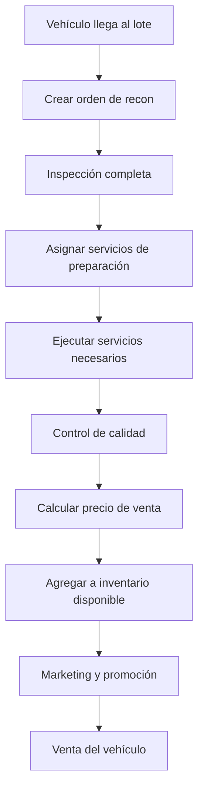

**KPIs del Proceso:**
- 📊 **Tiempo de Preparación**: 5-10 días promedio
- 💰 **Costo de Preparación**: 2-5% del valor del vehículo
- 📈 **Tasa de Rotación**: 45-60 días promedio en lote
- 🎯 **Margen de Ganancia**: 15-25% sobre costo total

#### **Proceso 2: Servicios Post-Venta**
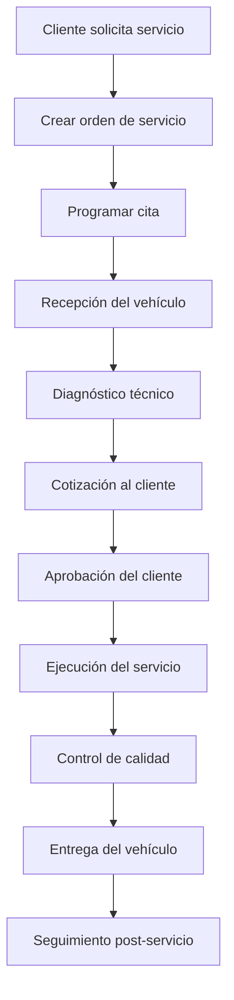

**Métricas de Negocio:**
- 💵 **Revenue por Vehículo**: $800-2,500 anual
- ⭐ **Satisfacción del Cliente**: >90% objetivo
- 🔄 **Retención de Clientes**: >75% anual
- ⏱️ **Tiempo de Servicio**: Según complejidad (1-8 horas)

### **Talleres Independientes**

#### **Proceso 1: Gestión de Órdenes de Trabajo**
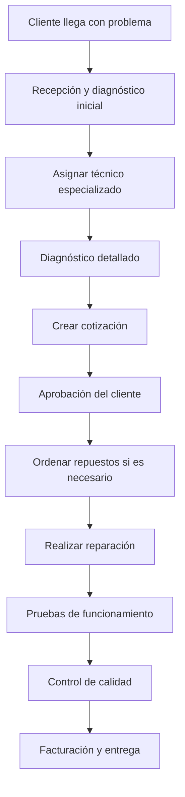

**Indicadores de Performance:**
- 🔧 **Utilización de Técnicos**: 75-85% objetivo
- 💰 **Margen por Hora**: $50-120 según especialidad
- ⚡ **Tiempo de Respuesta**: <24 horas para citas
- 📊 **Tasa de Retrabajo**: <5% objetivo

### **Car Wash y Detailing**

#### **Proceso 1: Operaciones de Lavado**
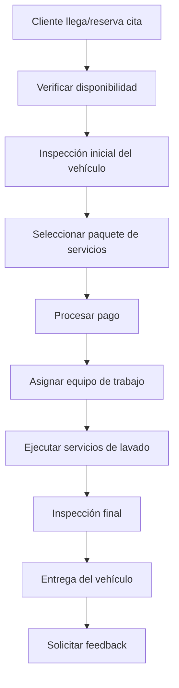

**Métricas Operativas:**
- 🚗 **Vehículos por Día**: 50-150 según capacidad
- ⏱️ **Tiempo Promedio**: 30-120 minutos según servicio
- 💰 **Ticket Promedio**: $25-80 por servicio
- 📈 **Margen de Ganancia**: 60-80% sobre costos

---

## 💼 **Procesos Financieros**

### **Gestión de Ingresos**

#### **Flujo de Facturación**
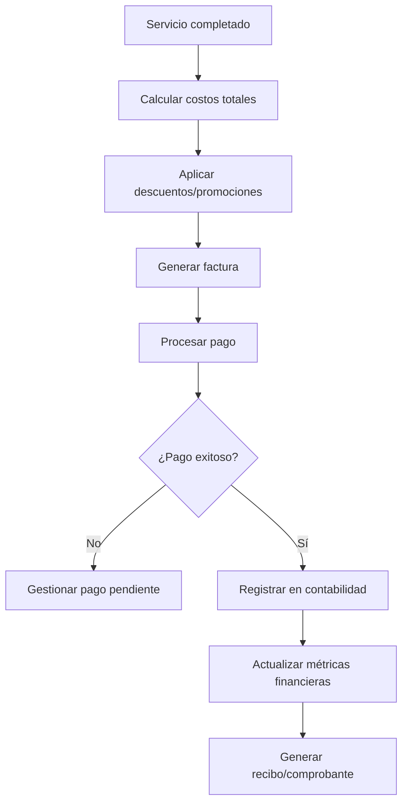

#### **Estructura de Costos**
```php
$costStructure = [
    'direct_costs' => [
        'labor' => 'Horas de trabajo × tarifa por hora',
        'materials' => 'Repuestos, productos químicos, consumibles',
        'overhead' => 'Servicios públicos, renta, seguros'
    ],
    'indirect_costs' => [
        'administration' => 'Personal administrativo, software',
        'marketing' => 'Publicidad, promociones',
        'maintenance' => 'Equipos, herramientas, instalaciones'
    ],
    'profit_margin' => [
        'target' => '20-30% sobre costos totales',
        'minimum' => '15% para viabilidad',
        'premium' => '35-50% para servicios especializados'
    ]
];
```

### **Gestión de Cuentas por Cobrar**

#### **Proceso de Cobranza**
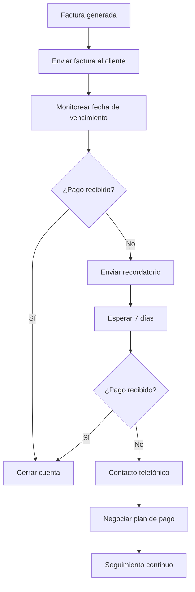

**Políticas de Crédito:**
- 🏢 **Clientes Corporativos**: 30 días términos estándar
- 👤 **Clientes Individuales**: Pago al momento del servicio
- 💳 **Métodos de Pago**: Efectivo, tarjetas, transferencias, financiamiento
- 📊 **Límites de Crédito**: Basados en historial y volumen

---

## 👥 **Procesos de Recursos Humanos**

### **Gestión de Personal**

#### **Proceso de Contratación**
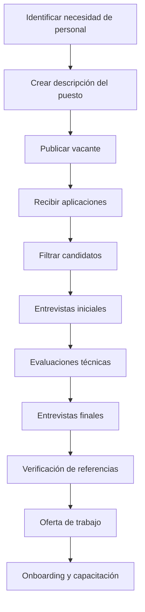

#### **Evaluación de Performance**
```php
$performanceMetrics = [
    'technicians' => [
        'efficiency' => 'Tiempo real vs tiempo estimado',
        'quality' => 'Tasa de retrabajo y satisfacción cliente',
        'productivity' => 'Órdenes completadas por día',
        'safety' => 'Incidentes y cumplimiento de protocolos'
    ],
    'staff' => [
        'customer_service' => 'Ratings de satisfacción cliente',
        'accuracy' => 'Precisión en órdenes y documentación',
        'sales' => 'Upselling y cross-selling efectivo',
        'attendance' => 'Puntualidad y ausentismo'
    ],
    'managers' => [
        'team_performance' => 'Métricas del equipo bajo su supervisión',
        'financial' => 'Cumplimiento de objetivos financieros',
        'leadership' => '360° feedback de equipo',
        'process_improvement' => 'Iniciativas de mejora implementadas'
    ]
];
```

### **Capacitación y Desarrollo**

#### **Programa de Capacitación**
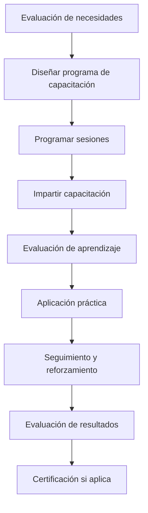

**Tipos de Capacitación:**
- 🔧 **Técnica**: Nuevas tecnologías, herramientas, procedimientos
- 💼 **Servicio al Cliente**: Comunicación, manejo de quejas
- 🛡️ **Seguridad**: Protocolos de seguridad, uso de EPP
- 📊 **Sistemas**: Uso del software MDA, reportes, análisis

---

## 📊 **Procesos de Calidad**

### **Control de Calidad**

#### **Sistema de QC Multi-Nivel**
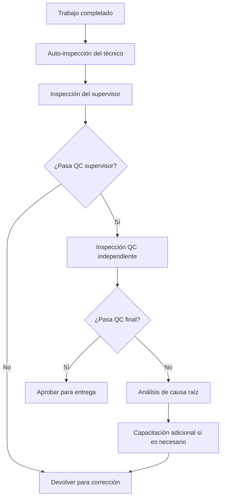

#### **Métricas de Calidad**
```php
$qualityMetrics = [
    'first_pass_yield' => [
        'definition' => 'Porcentaje de trabajos que pasan QC en el primer intento',
        'target' => '>95%',
        'measurement' => 'Semanal por técnico y tipo de servicio'
    ],
    'customer_satisfaction' => [
        'definition' => 'Rating promedio de satisfacción del cliente',
        'target' => '>4.5/5.0',
        'measurement' => 'Mensual con seguimiento de tendencias'
    ],
    'rework_rate' => [
        'definition' => 'Porcentaje de trabajos que requieren retrabajo',
        'target' => '<3%',
        'measurement' => 'Mensual por categoría de servicio'
    ],
    'warranty_claims' => [
        'definition' => 'Número de reclamaciones de garantía',
        'target' => '<1% de servicios realizados',
        'measurement' => 'Trimestral con análisis de causas'
    ]
];
```

### **Mejora Continua**

#### **Proceso de Mejora (PDCA)**
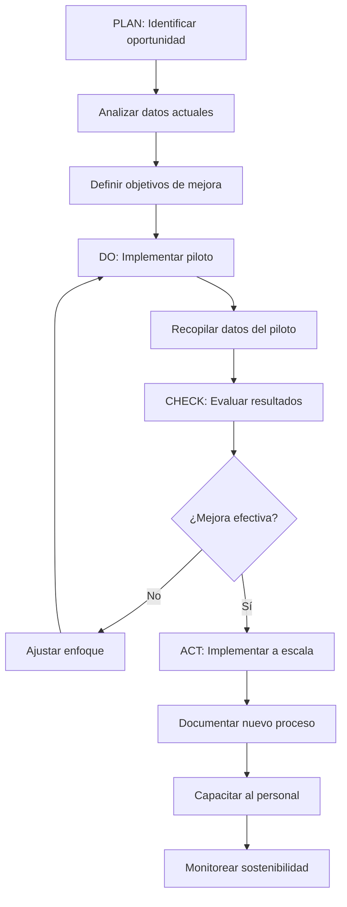

---

## 🎯 **Procesos de Marketing y Ventas**

### **Generación de Leads**

#### **Estrategia Multi-Canal**
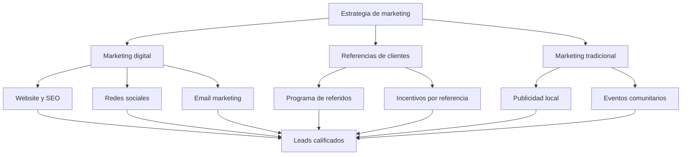

#### **Conversión de Leads**
```php
$conversionProcess = [
    'lead_capture' => [
        'methods' => ['Website forms', 'Phone calls', 'Walk-ins', 'Referrals'],
        'qualification' => 'BANT (Budget, Authority, Need, Timeline)',
        'response_time' => '<2 hours for hot leads'
    ],
    'nurturing' => [
        'email_sequences' => 'Automated follow-up campaigns',
        'content_marketing' => 'Educational content about services',
        'retargeting' => 'Digital ads for website visitors'
    ],
    'conversion' => [
        'appointment_setting' => 'Schedule initial consultation',
        'needs_assessment' => 'Understand customer requirements',
        'proposal' => 'Customized service recommendations',
        'closing' => 'Convert to paying customer'
    ]
];
```

### **Retención de Clientes**

#### **Programa de Lealtad**
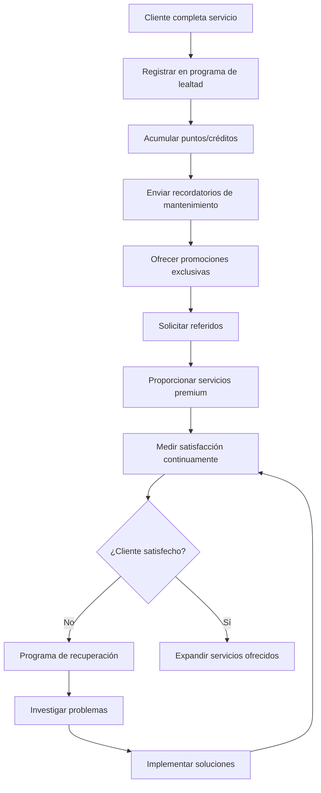

**Estrategias de Retención:**
- 🎁 **Programas de Lealtad**: Puntos, descuentos, servicios gratuitos
- 📅 **Recordatorios Automáticos**: Mantenimiento preventivo, inspecciones
- 🌟 **Servicios VIP**: Atención prioritaria, servicios a domicilio
- 💬 **Comunicación Proactiva**: Updates, promociones, contenido educativo

---

## 📈 **Procesos de Análisis y Reporting**

### **Business Intelligence**

#### **Dashboard Ejecutivo**
```php
$executiveDashboard = [
    'financial_kpis' => [
        'revenue' => 'Ingresos mensuales vs objetivo',
        'profit_margin' => 'Margen de ganancia por servicio',
        'accounts_receivable' => 'Cuentas por cobrar aging',
        'cash_flow' => 'Flujo de efectivo proyectado'
    ],
    'operational_kpis' => [
        'capacity_utilization' => 'Utilización de técnicos y equipos',
        'service_efficiency' => 'Tiempo real vs estimado',
        'quality_metrics' => 'Tasa de retrabajo y satisfacción',
        'inventory_turnover' => 'Rotación de repuestos y suministros'
    ],
    'customer_kpis' => [
        'customer_acquisition' => 'Nuevos clientes por mes',
        'customer_retention' => 'Tasa de retención anual',
        'lifetime_value' => 'Valor de vida del cliente',
        'satisfaction_scores' => 'NPS y ratings promedio'
    ]
];
```

#### **Proceso de Reporting**
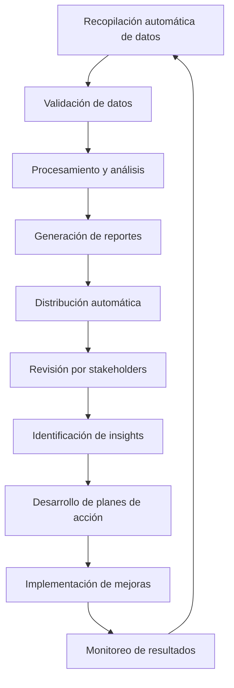

### **Análisis Predictivo**

#### **Forecasting de Demanda**
```php
$demandForecasting = [
    'seasonal_patterns' => [
        'spring' => 'Aumento en servicios de AC y detailing',
        'summer' => 'Peak en car wash y servicios de viaje',
        'fall' => 'Preparación para invierno, cambio de llantas',
        'winter' => 'Servicios de calefacción y mantenimiento'
    ],
    'predictive_models' => [
        'service_demand' => 'Basado en historial y factores externos',
        'customer_churn' => 'Identificar clientes en riesgo',
        'inventory_needs' => 'Optimizar niveles de stock',
        'capacity_planning' => 'Planificar recursos humanos'
    ]
];
```

---

## 🔄 **Procesos de Integración**

### **Integración con Sistemas Externos**

#### **ERP Integration**
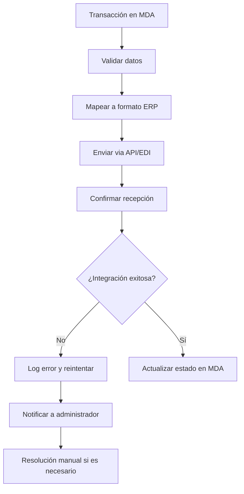

#### **CRM Synchronization**
```php
$crmIntegration = [
    'customer_data' => [
        'sync_frequency' => 'Real-time for critical data',
        'fields' => ['contact_info', 'service_history', 'preferences'],
        'conflict_resolution' => 'MDA as master for service data'
    ],
    'sales_pipeline' => [
        'lead_qualification' => 'Auto-sync qualified leads to MDA',
        'opportunity_tracking' => 'Service opportunities from CRM',
        'conversion_tracking' => 'Close loop on converted leads'
    ],
    'marketing_automation' => [
        'campaign_triggers' => 'Service completion triggers',
        'segmentation' => 'Customer segments based on service history',
        'personalization' => 'Customized offers based on MDA data'
    ]
];
```

---

## 🎯 **Procesos de Compliance y Regulaciones**

### **Cumplimiento Regulatorio**

#### **Documentación y Auditoría**
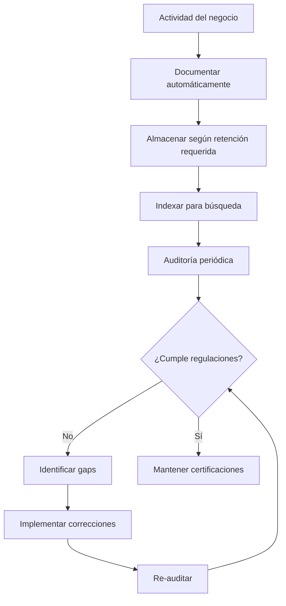

#### **Áreas de Compliance**
```php
$complianceAreas = [
    'environmental' => [
        'waste_disposal' => 'Manejo de aceites, químicos, baterías',
        'emissions' => 'Control de emisiones del taller',
        'water_treatment' => 'Tratamiento de aguas residuales'
    ],
    'safety' => [
        'worker_safety' => 'OSHA compliance, EPP, capacitación',
        'customer_safety' => 'Protocolos de seguridad en instalaciones',
        'equipment_safety' => 'Mantenimiento y certificación de equipos'
    ],
    'financial' => [
        'tax_compliance' => 'Reportes fiscales, retenciones',
        'labor_laws' => 'Cumplimiento de leyes laborales',
        'consumer_protection' => 'Garantías, políticas de devolución'
    ]
];
```

---

**Los procesos de negocio de MDA están diseñados para optimizar las operaciones, maximizar la rentabilidad y asegurar la satisfacción del cliente a través de la automatización inteligente y el control de calidad sistemático.**

---

*Documentación actualizada: 2025-01-19*  
*Versión de procesos de negocio: MDA v2.0*  
*Para más información: [Volver a Documentación Principal](../../claude.md)*


