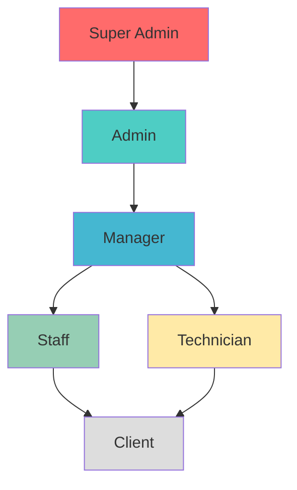
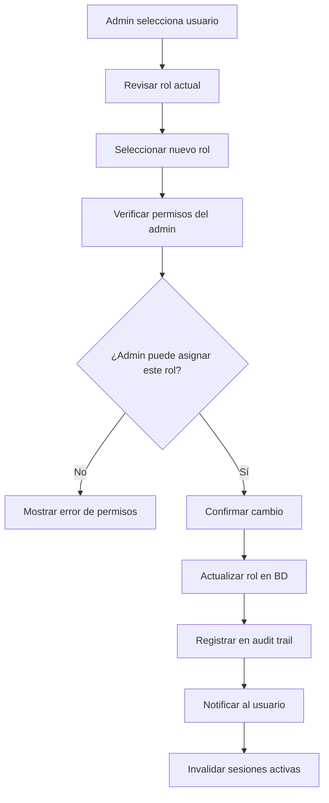
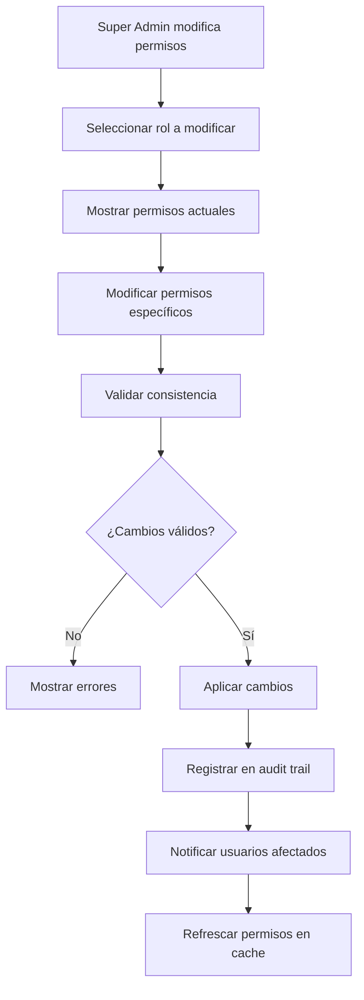

# 👥 User Roles - Documentación Completa

## 📋 **Información General**

Esta documentación detalla el sistema completo de roles y permisos del sistema MDA, definiendo responsabilidades, accesos y limitaciones para cada tipo de usuario.

---

## 🏗️ **Arquitectura de Roles**

### **Jerarquía de Roles**


### **Principios del Sistema de Roles**
- **Principio de Menor Privilegio**: Usuarios tienen solo los permisos necesarios
- **Separación de Responsabilidades**: Roles claramente definidos
- **Escalabilidad**: Fácil agregar nuevos roles y permisos
- **Auditoría**: Todos los cambios de permisos son registrados
- **Flexibilidad**: Permisos granulares por módulo y acción

---

## 👑 **Super Admin**

### **Descripción**
El Super Admin tiene control total sobre el sistema, incluyendo configuraciones críticas, gestión de usuarios y acceso a todas las funcionalidades.

### **Responsabilidades Principales**
- 🔧 **Configuración del Sistema**: Settings globales, integraciones, APIs
- 👥 **Gestión de Usuarios**: Crear, modificar, eliminar cualquier usuario
- 🔒 **Seguridad**: Gestión de roles, permisos, auditoría
- 📊 **Monitoreo**: Acceso completo a logs, métricas, performance
- 🚀 **Deployment**: Gestión de actualizaciones y mantenimiento

### **Permisos Completos**
```php
$superAdminPermissions = [
    // Sistema
    'system:*',
    'settings:*',
    'integrations:*',
    'backup:*',
    'logs:*',
    
    // Usuarios y Roles
    'users:*',
    'roles:*',
    'permissions:*',
    
    // Todos los módulos
    'sales_orders:*',
    'service_orders:*',
    'car_wash:*',
    'recon_orders:*',
    'vehicles:*',
    'public_pages:*',
    
    // Funciones especiales
    'audit_trail:*',
    'database:*',
    'api_keys:*'
];
```

### **Limitaciones**
- ⚠️ **Responsabilidad Total**: Cambios pueden afectar todo el sistema
- 📝 **Auditoría Obligatoria**: Todas las acciones son registradas
- 🔐 **2FA Requerido**: Autenticación de dos factores obligatoria (futuro)

### **Casos de Uso Típicos**
1. **Configuración Inicial**: Setup del sistema para nueva instalación
2. **Gestión de Crisis**: Resolución de problemas críticos
3. **Actualizaciones**: Deploy de nuevas versiones
4. **Auditoría de Seguridad**: Revisión de accesos y permisos
5. **Integración de APIs**: Configuración de servicios externos

---

## 🔧 **Admin**

### **Descripción**
Los Administradores gestionan las operaciones diarias del sistema, usuarios y configuraciones no críticas.

### **Responsabilidades Principales**
- 👥 **Gestión de Staff**: Crear y gestionar usuarios operativos
- 📊 **Reportes y Analytics**: Acceso a métricas de negocio
- ⚙️ **Configuraciones**: Settings de módulos y operaciones
- 🔍 **Supervisión**: Monitoreo de actividades y performance
- 📋 **Gestión de Clientes**: Administración de clientes y contactos

### **Permisos Detallados**
```php
$adminPermissions = [
    // Gestión de usuarios (excepto Super Admin)
    'users:create',
    'users:read',
    'users:update',
    'users:delete', // Solo roles inferiores
    'users:activate',
    'users:deactivate',
    
    // Clientes y contactos
    'clients:*',
    'contacts:*',
    
    // Módulos principales - gestión completa
    'sales_orders:*',
    'service_orders:*',
    'car_wash:*',
    'recon_orders:*',
    'vehicles:*',
    
    // Reportes y analytics
    'reports:*',
    'analytics:*',
    'dashboard:admin',
    
    // Configuraciones de módulos
    'settings:modules',
    'settings:notifications',
    'settings:templates',
    
    // Public pages
    'public_pages:*',
    
    // Auditoría (solo lectura)
    'audit_trail:read'
];
```

### **Limitaciones**
- ❌ **No puede modificar**: Configuraciones de sistema críticas
- ❌ **No puede crear**: Otros admins o super admins
- ❌ **No puede acceder**: Logs de sistema, configuraciones de seguridad
- ⏰ **Horarios**: Puede tener restricciones de horario de acceso

### **Dashboard Específico**
- 📊 **Métricas de Negocio**: KPIs principales, tendencias
- 👥 **Gestión de Staff**: Lista de usuarios, performance
- 📋 **Órdenes Recientes**: Actividad del día
- 🚨 **Alertas**: Problemas que requieren atención
- 📈 **Reportes Ejecutivos**: Análisis de performance

---

## 📋 **Manager**

### **Descripción**
Los Managers supervisan operaciones específicas, asignan trabajo y aseguran el cumplimiento de objetivos.

### **Responsabilidades Principales**
- 👥 **Supervisión de Staff**: Asignación de tareas y seguimiento
- 📅 **Planificación**: Programación de servicios y recursos
- 🎯 **Control de Calidad**: Revisión y aprobación de trabajos
- 📊 **Métricas de Equipo**: Monitoreo de performance del equipo
- 🤝 **Relación con Clientes**: Manejo de situaciones complejas

### **Permisos por Módulo**
```php
$managerPermissions = [
    // Órdenes - gestión completa
    'sales_orders:create',
    'sales_orders:read',
    'sales_orders:update',
    'sales_orders:assign',
    'sales_orders:approve',
    
    'service_orders:create',
    'service_orders:read',
    'service_orders:update',
    'service_orders:assign',
    'service_orders:quality_control',
    
    'car_wash:*', // Gestión completa del car wash
    'recon_orders:*', // Gestión completa de recon
    
    // Vehículos
    'vehicles:read',
    'vehicles:update',
    'vehicles:location_tracking',
    
    // Staff (solo lectura y asignación)
    'users:read',
    'users:assign_tasks',
    
    // Clientes
    'clients:read',
    'clients:update',
    'contacts:*',
    
    // Reportes de su área
    'reports:team',
    'reports:operations',
    'analytics:department'
];
```

### **Restricciones Específicas**
- 🔒 **Solo su equipo**: No puede ver/modificar trabajo de otros managers
- 💰 **Límites financieros**: Aprobaciones hasta cierto monto
- 📅 **Horarios**: Acceso durante horarios de operación
- 👥 **Staff**: No puede crear/eliminar usuarios

### **Herramientas de Manager**
- 📊 **Dashboard de Equipo**: Performance individual y grupal
- 📅 **Planificador**: Asignación de tareas y recursos
- 🎯 **Objetivos**: Seguimiento de metas del equipo
- 📋 **Checklists**: Listas de verificación por proceso
- 📞 **Comunicación**: Chat directo con su equipo

---

## 👷 **Staff**

### **Descripción**
El Staff ejecuta las operaciones diarias del sistema, creando y gestionando órdenes según sus asignaciones.

### **Responsabilidades Principales**
- 📝 **Creación de Órdenes**: Registrar nuevos trabajos y servicios
- 🔄 **Actualización de Estado**: Mantener información actualizada
- 💬 **Comunicación**: Interactuar con clientes y equipo
- 📸 **Documentación**: Fotos, notas y seguimiento
- ⏰ **Cumplimiento**: Completar tareas en tiempo y forma

### **Permisos Operativos**
```php
$staffPermissions = [
    // Órdenes - operaciones básicas
    'sales_orders:create',
    'sales_orders:read',
    'sales_orders:update_own', // Solo las que creó o están asignadas
    'sales_orders:comment',
    
    'service_orders:read',
    'service_orders:update_assigned', // Solo las asignadas a él
    'service_orders:comment',
    
    'car_wash:create',
    'car_wash:read',
    'car_wash:update_assigned',
    
    'recon_orders:read',
    'recon_orders:update_assigned',
    
    // Vehículos
    'vehicles:read',
    'vehicles:location_update',
    
    // Clientes (solo lectura)
    'clients:read',
    'contacts:read',
    
    // Su propio perfil
    'profile:update',
    'profile:notifications',
    
    // Archivos
    'files:upload',
    'files:view_own'
];
```

### **Limitaciones del Staff**
- 📋 **Solo órdenes asignadas**: No puede ver todas las órdenes
- ❌ **No puede eliminar**: Órdenes o datos importantes
- 👥 **No gestión de usuarios**: No puede crear/modificar usuarios
- 💰 **Sin datos financieros**: No acceso a precios/costos
- ⏰ **Horarios limitados**: Acceso durante su turno

### **Interface Simplificada**
- 📋 **Mis Tareas**: Lista de órdenes asignadas
- 📅 **Calendario**: Sus citas y programación
- 💬 **Chat**: Comunicación con supervisores
- 📊 **Mi Performance**: Sus métricas personales
- 🔔 **Notificaciones**: Alertas relevantes

---

## 🔧 **Technician**

### **Descripción**
Los Técnicos son especialistas que ejecutan servicios técnicos específicos con permisos especializados.

### **Responsabilidades Principales**
- 🔧 **Servicios Técnicos**: Diagnóstico, reparación, mantenimiento
- 📋 **Documentación Técnica**: Reportes detallados de trabajo
- 🛠️ **Gestión de Herramientas**: Control de equipos y herramientas
- 📸 **Evidencia Visual**: Fotos antes/durante/después
- 🎓 **Especialización**: Servicios según certificaciones

### **Permisos Especializados**
```php
$technicianPermissions = [
    // Service Orders - acceso completo técnico
    'service_orders:read',
    'service_orders:update_technical',
    'service_orders:diagnose',
    'service_orders:repair',
    'service_orders:quality_check',
    'service_orders:notes_technical',
    
    // Vehículos - información técnica
    'vehicles:read',
    'vehicles:technical_update',
    'vehicles:inspection',
    
    // Recon Orders - inspección técnica
    'recon_orders:read',
    'recon_orders:inspect',
    'recon_orders:estimate',
    
    // Car Wash - servicios técnicos especializados
    'car_wash:technical_services',
    'car_wash:quality_control',
    
    // Herramientas y recursos
    'tools:read',
    'tools:reserve',
    'parts:read',
    'parts:request',
    
    // Documentación técnica
    'technical_docs:read',
    'technical_docs:create',
    
    // Su perfil y certificaciones
    'profile:update',
    'certifications:view'
];
```

### **Especialidades por Técnico**
```php
$technicianSpecialties = [
    'engine_specialist' => [
        'permissions' => ['engine:*', 'transmission:*'],
        'certifications' => ['ASE Engine', 'Manufacturer Certified']
    ],
    'electrical_specialist' => [
        'permissions' => ['electrical:*', 'diagnostics:*'],
        'certifications' => ['ASE Electrical', 'Hybrid Certified']
    ],
    'body_specialist' => [
        'permissions' => ['body_work:*', 'paint:*'],
        'certifications' => ['Body Repair', 'Paint Certified']
    ],
    'general_technician' => [
        'permissions' => ['maintenance:*', 'basic_repair:*'],
        'certifications' => ['General ASE']
    ]
];
```

### **Herramientas del Técnico**
- 🔧 **Panel Técnico**: Órdenes asignadas con detalles técnicos
- 📋 **Checklists**: Listas específicas por tipo de servicio
- 🛠️ **Inventario**: Estado de herramientas y repuestos
- 📊 **Métricas**: Tiempo por trabajo, calidad, eficiencia
- 📱 **App Móvil**: Interface optimizada para taller

---

## 👤 **Client**

### **Descripción**
Los Clientes tienen acceso limitado para ver sus órdenes, comunicarse y gestionar su información.

### **Responsabilidades**
- 📋 **Seguimiento**: Monitorear estado de sus órdenes
- 💬 **Comunicación**: Interactuar con el equipo de servicio
- 📝 **Información**: Mantener sus datos actualizados
- ⭐ **Feedback**: Proporcionar calificaciones y comentarios

### **Permisos Limitados**
```php
$clientPermissions = [
    // Solo sus propias órdenes
    'sales_orders:read_own',
    'service_orders:read_own',
    'car_wash:read_own',
    'recon_orders:read_own',
    
    // Solo sus vehículos
    'vehicles:read_own',
    'vehicles:location_own',
    
    // Comunicación
    'comments:create_own_orders',
    'messages:send_to_staff',
    'notifications:receive',
    
    // Su información
    'profile:read',
    'profile:update_basic',
    'contacts:read_own',
    'contacts:update_own',
    
    // Descargas
    'files:download_own',
    'pdf:download_own',
    
    // Feedback
    'ratings:create',
    'reviews:create'
];
```

### **Interface del Cliente**
- 📋 **Mis Órdenes**: Lista de servicios actuales e históricos
- 🚗 **Mis Vehículos**: Información de vehículos registrados
- 💬 **Mensajes**: Comunicación con el equipo
- 📄 **Documentos**: Facturas, reportes, garantías
- ⭐ **Calificaciones**: Historial de feedback proporcionado

---

## 🔐 **Gestión de Permisos Granulares**

### **Estructura de Permisos**
```php
// Formato: módulo:acción:contexto
$permissionStructure = [
    'sales_orders:create:*',           // Crear cualquier orden
    'sales_orders:read:own',           // Leer solo propias órdenes
    'sales_orders:update:assigned',    // Actualizar solo asignadas
    'sales_orders:delete:none',        // No puede eliminar
    'sales_orders:assign:team',        // Asignar solo a su equipo
];
```

### **Permisos Especiales**
```php
$specialPermissions = [
    // Financieros
    'financial:view_costs',
    'financial:view_profits',
    'financial:approve_discounts',
    
    // Administrativos
    'admin:backup_system',
    'admin:view_logs',
    'admin:manage_integrations',
    
    // Operativos
    'operations:emergency_override',
    'operations:bulk_actions',
    'operations:quality_control',
    
    // Reportes
    'reports:executive',
    'reports:financial',
    'reports:operational',
    'reports:technical'
];
```

---

## 📊 **Matrix de Permisos por Módulo**

### **Sales Orders**
| Rol | Create | Read | Update | Delete | Assign | Approve |
|-----|--------|------|--------|--------|--------|---------|
| Super Admin | ✅ | ✅ | ✅ | ✅ | ✅ | ✅ |
| Admin | ✅ | ✅ | ✅ | ✅ | ✅ | ✅ |
| Manager | ✅ | ✅ | ✅ | ❌ | ✅ | ✅ |
| Staff | ✅ | Own | Own | ❌ | ❌ | ❌ |
| Technician | ❌ | Assigned | Assigned | ❌ | ❌ | ❌ |
| Client | ❌ | Own | ❌ | ❌ | ❌ | ❌ |

### **Service Orders**
| Rol | Create | Read | Update | Delete | QC | Notes |
|-----|--------|------|--------|--------|----|----|
| Super Admin | ✅ | ✅ | ✅ | ✅ | ✅ | ✅ |
| Admin | ✅ | ✅ | ✅ | ✅ | ✅ | ✅ |
| Manager | ✅ | ✅ | ✅ | ❌ | ✅ | ✅ |
| Staff | ❌ | Own | Own | ❌ | ❌ | Own |
| Technician | ❌ | Assigned | Technical | ❌ | ✅ | Technical |
| Client | ❌ | Own | ❌ | ❌ | ❌ | Own |

---

## 🔄 **Workflows de Gestión de Roles**

### **Asignación de Rol a Usuario**


### **Modificación de Permisos**


---

## 🚨 **Casos Especiales y Excepciones**

### **Modo de Emergencia**
```php
$emergencyMode = [
    'trigger' => 'Sistema crítico down',
    'permissions' => [
        'managers' => 'Permisos temporales de admin',
        'staff' => 'Permisos temporales de manager',
        'duration' => '4 hours maximum',
        'approval' => 'Super Admin required'
    ]
];
```

### **Permisos Temporales**
```php
$temporaryPermissions = [
    'vacation_coverage' => [
        'duration' => 'Mientras dure la ausencia',
        'scope' => 'Solo responsabilidades del ausente',
        'approval' => 'Manager + Admin'
    ],
    'training_period' => [
        'duration' => '30 days',
        'scope' => 'Permisos adicionales para aprendizaje',
        'supervision' => 'Required'
    ]
];
```

### **Roles Híbridos**
```php
$hybridRoles = [
    'manager_technician' => [
        'base_role' => 'manager',
        'additional_permissions' => ['technical:*'],
        'use_case' => 'Manager técnico especializado'
    ],
    'senior_staff' => [
        'base_role' => 'staff',
        'additional_permissions' => ['training:mentor', 'quality:basic'],
        'use_case' => 'Staff con responsabilidades adicionales'
    ]
];
```

---

## 📈 **Métricas y Auditoría de Roles**

### **KPIs de Roles**
- 👥 **Distribución de Roles**: Porcentaje por tipo de rol
- 🔄 **Cambios de Rol**: Frecuencia de modificaciones
- 🚨 **Violaciones de Acceso**: Intentos de acceso no autorizado
- ⏱️ **Tiempo de Sesión**: Promedio por rol
- 📊 **Uso de Permisos**: Permisos más/menos utilizados

### **Reportes de Auditoría**
- 📋 **Reporte de Accesos**: Quién accedió a qué y cuándo
- 🔍 **Reporte de Cambios**: Modificaciones de roles y permisos
- ⚠️ **Reporte de Anomalías**: Actividad sospechosa
- 📊 **Reporte de Uso**: Utilización de funcionalidades por rol

---

**El sistema de roles de MDA proporciona un control granular y flexible sobre el acceso y las funcionalidades, asegurando que cada usuario tenga exactamente los permisos necesarios para sus responsabilidades.**

---

*Documentación actualizada: 2025-01-19*  
*Versión del sistema de roles: MDA v2.0*  
*Para más información: [Volver a Documentación Principal](../../claude.md)*


