# ⚡ Workflows por Módulo - Documentación Completa

## 📋 **Información General**

Esta documentación detalla los flujos de trabajo operativos de cada módulo del sistema MDA, proporcionando una guía paso a paso para usuarios, managers y administradores.

---

## 🛒 **Sales Orders - Workflows**

### **Workflow Principal: Gestión de Órdenes de Venta**

#### **1. Creación de Orden**
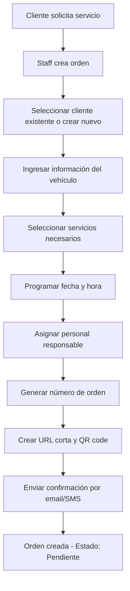

**Roles Involucrados:**
- **Staff/Manager**: Crea la orden
- **Cliente**: Proporciona información
- **Sistema**: Genera automáticamente número, URL y QR

**Tiempo Estimado:** 5-10 minutos

#### **2. Confirmación y Programación**
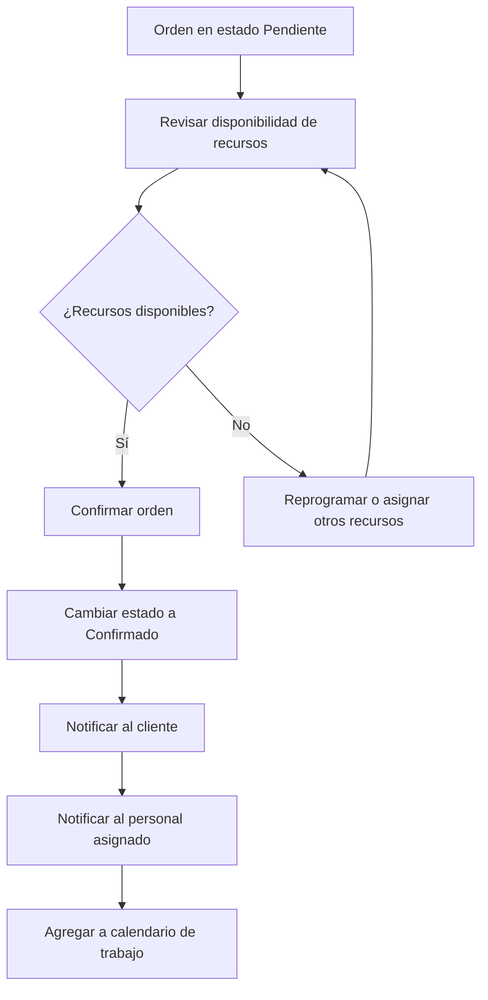

**Responsable:** Manager o Staff Senior
**Tiempo Estimado:** 2-5 minutos

#### **3. Ejecución del Servicio**
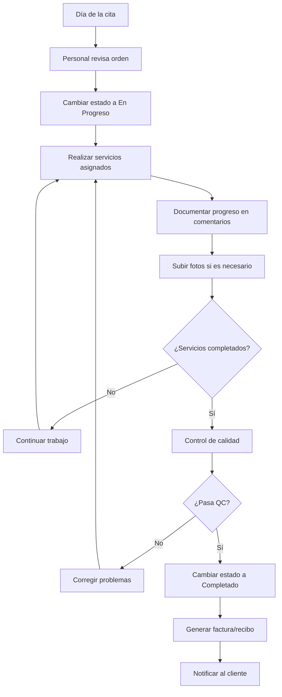

**Responsables:** Personal asignado + Supervisor
**Tiempo Estimado:** Según tipo de servicio (30 min - 8 horas)

### **Workflow de Emergencia: Orden Urgente**
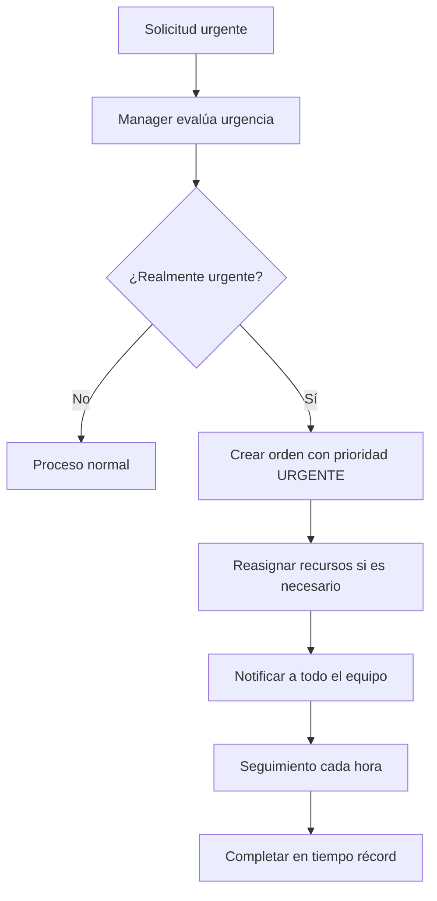

---

## 🔧 **Service Orders - Workflows**

### **Workflow Principal: Órdenes de Servicio Técnico**

#### **1. Recepción del Vehículo**
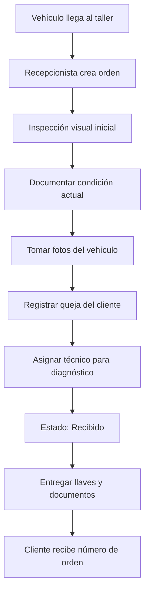

**Responsable:** Recepcionista + Service Advisor
**Tiempo Estimado:** 15-20 minutos

#### **2. Diagnóstico Técnico**
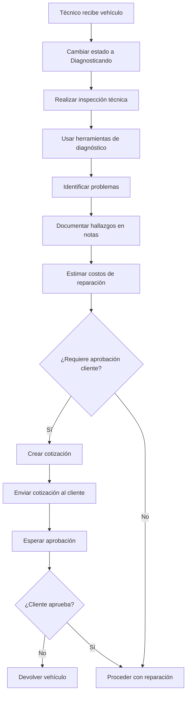

**Responsable:** Técnico asignado
**Tiempo Estimado:** 30 minutos - 2 horas

#### **3. Proceso de Reparación**
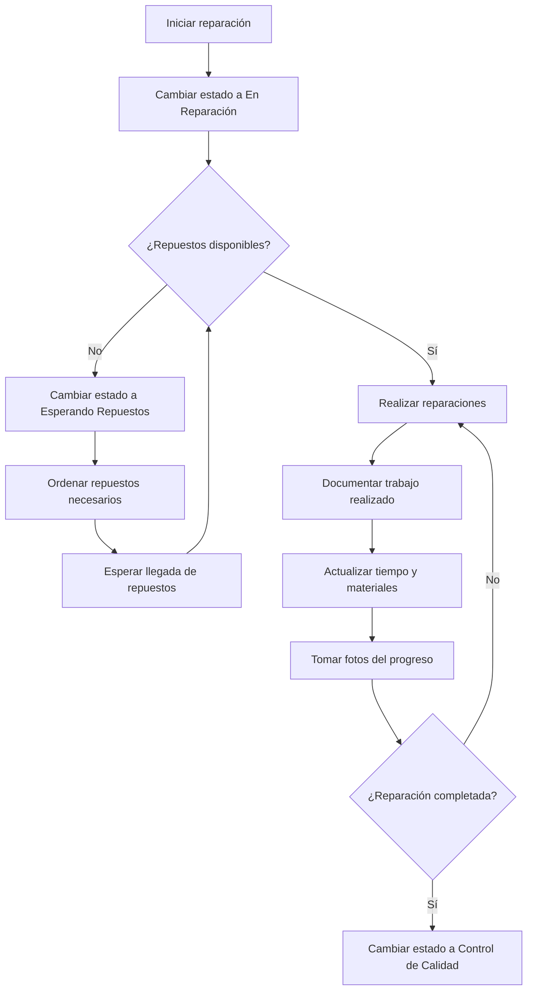

**Responsable:** Técnico + Supervisor
**Tiempo Estimado:** 2-8 horas (según complejidad)

#### **4. Control de Calidad**
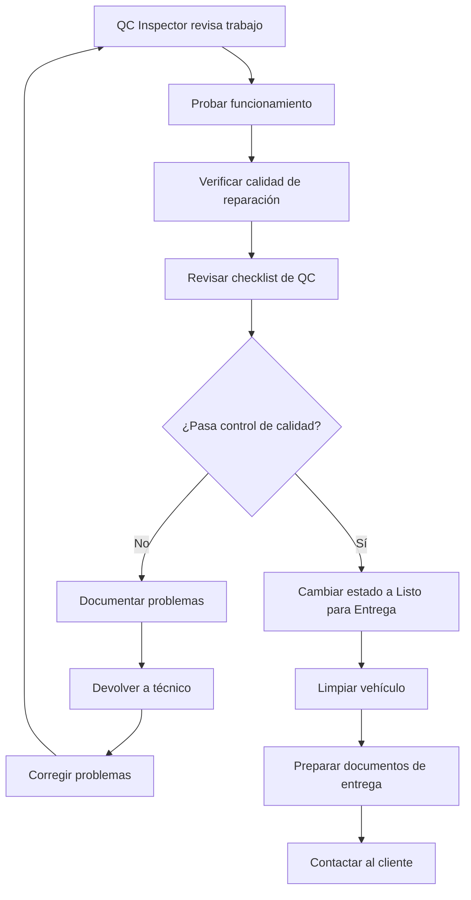

**Responsable:** QC Inspector
**Tiempo Estimado:** 30-60 minutos

### **Workflow Especializado: Servicios de Garantía**
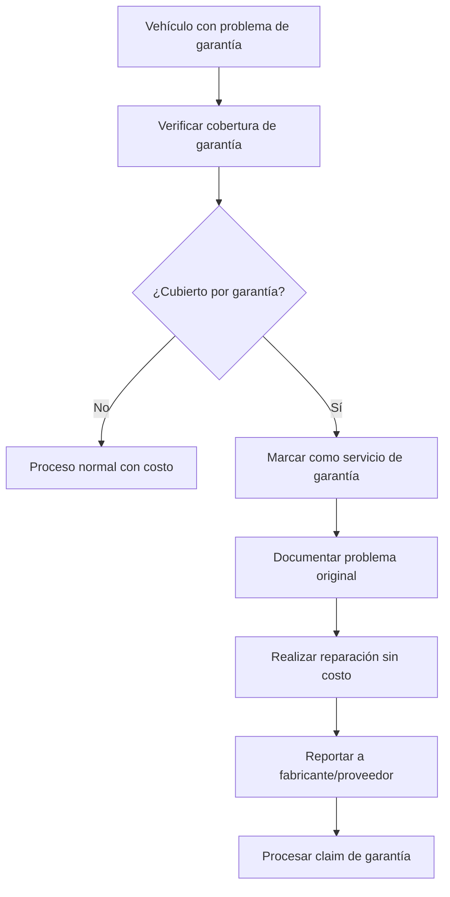

---

## 🚗 **Car Wash - Workflows**

### **Workflow Principal: Servicio de Lavado**

#### **1. Recepción y Programación**
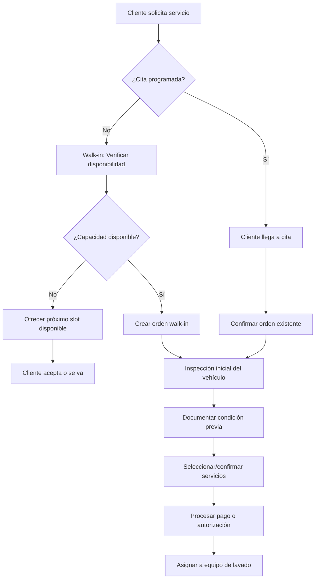

**Responsable:** Recepcionista + Supervisor
**Tiempo Estimado:** 5-10 minutos

#### **2. Proceso de Lavado**
```mermaid
flowchart TD
    A[Equipo recibe vehículo] --> B[Cambiar estado a En Progreso]
    B --> C[Pre-enjuague del vehículo]
    C --> D[Aplicar productos químicos]
    D --> E[Lavado manual/automático según servicio]
    E --> F[Enjuague completo]
    F --> G{¿Servicio incluye interior?}
    G -->|Sí| H[Aspirado y limpieza interior]
    G -->|No| I[Secado exterior]
    H --> I
    I --> J[Aplicar productos finales (cera, etc.)]
    J --> K[Inspección final]
    K --> L{¿Calidad aceptable?}
    L -->|No| M[Corregir problemas]
    M --> K
    L -->|Sí| N[Cambiar estado a Completado]
    N --> O[Mover a área de entrega]
```

**Responsables:** Equipo de lavado (2-3 personas)
**Tiempo Estimado:** 30 minutos - 2 horas

#### **3. Entrega del Vehículo**
```mermaid
flowchart TD
    A[Vehículo listo] --> B[Notificar al cliente]
    B --> C[Cliente llega para recoger]
    C --> D[Inspección final con cliente]
    D --> E{¿Cliente satisfecho?}
    E -->|No| F[Identificar problemas]
    F --> G[Corregir sin costo adicional]
    G --> D
    E -->|Sí| H[Procesar pago final]
    H --> I[Entregar llaves y recibo]
    I --> J[Solicitar feedback/rating]
    J --> K[Programar próximo servicio (opcional)]
```

**Responsable:** Supervisor + Recepcionista
**Tiempo Estimado:** 5-10 minutos

### **Workflow de Temporada Alta**
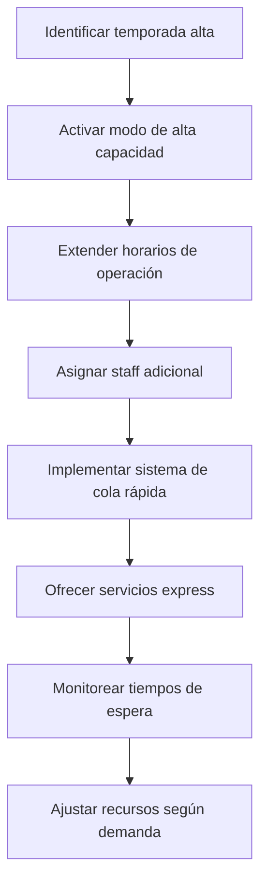

---

## 📋 **Recon Orders - Workflows**

### **Workflow Principal: Proceso de Reconocimiento**

#### **1. Ingreso de Vehículo**
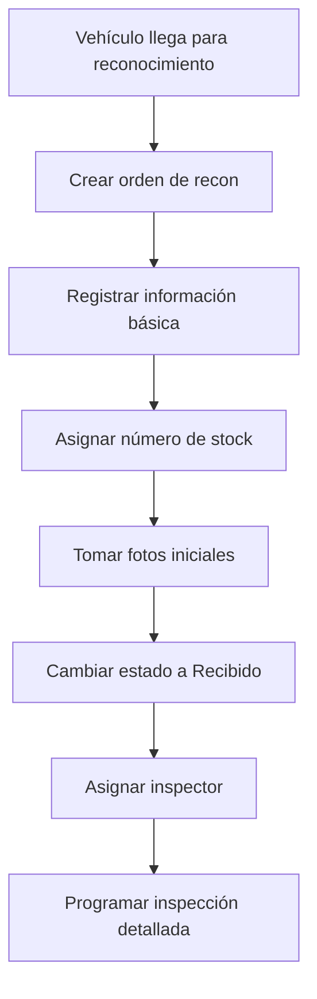

**Responsable:** Recepcionista + Manager
**Tiempo Estimado:** 15-20 minutos

#### **2. Inspección Detallada**
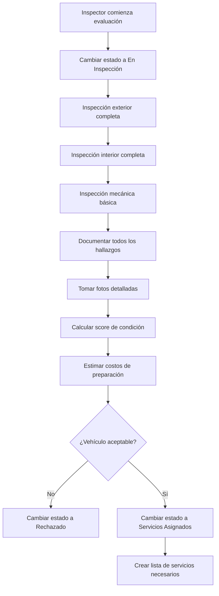

**Responsable:** Inspector certificado
**Tiempo Estimado:** 1-2 horas

#### **3. Preparación del Vehículo**
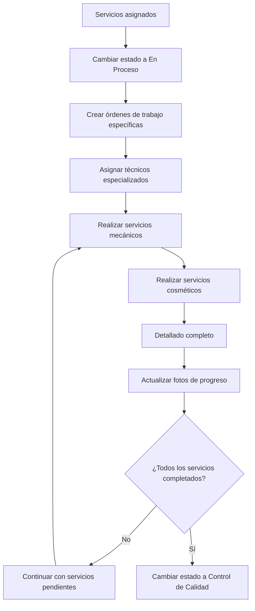

**Responsables:** Múltiples técnicos especializados
**Tiempo Estimado:** 3-10 días

#### **4. Control de Calidad Final**
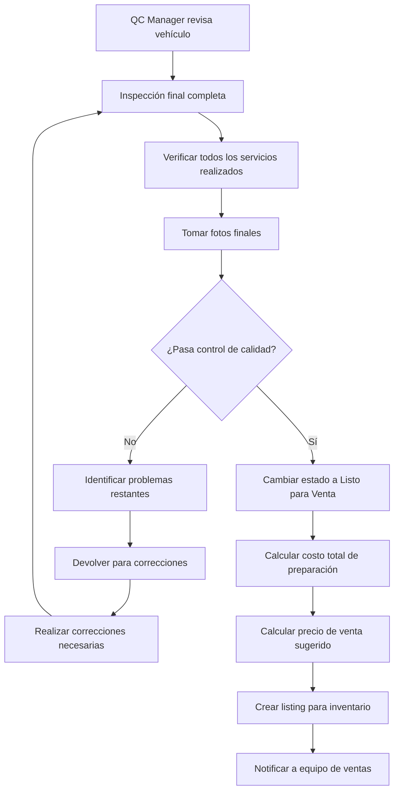

**Responsable:** QC Manager
**Tiempo Estimado:** 2-4 horas

### **Workflow de Importación Masiva CSV**
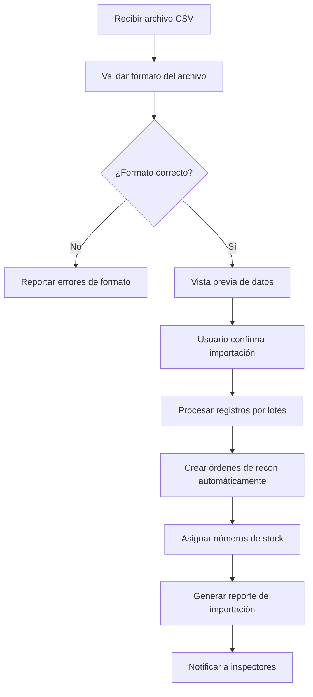

---

## 🚙 **Vehicles - Workflows**

### **Workflow Principal: Tracking de Ubicación NFC**

#### **1. Generación de Token NFC**
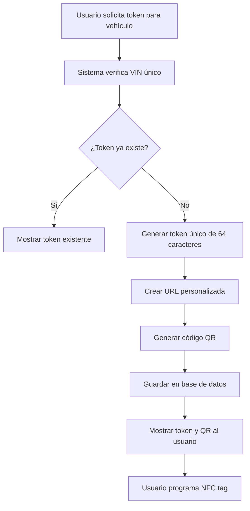

**Responsable:** Manager o Admin
**Tiempo Estimado:** 2-3 minutos

#### **2. Registro de Ubicación**
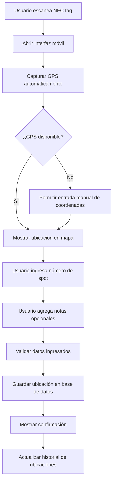

**Responsable:** Cualquier usuario con acceso al NFC tag
**Tiempo Estimado:** 1-2 minutos

#### **3. Consulta de Ubicación**
```mermaid
flowchart TD
    A[Usuario busca vehículo] --> B[Ingresar VIN o número de stock]
    B --> C[Sistema busca en base de datos]
    C --> D{¿Vehículo encontrado?}
    D -->|No| E[Mostrar mensaje de no encontrado]
    D -->|Sí| F[Mostrar ubicación actual]
    F --> G[Mostrar historial de ubicaciones]
    G --> H[Mostrar mapa con ubicación]
    H --> I[Opciones adicionales: direcciones, notas]
```

**Responsable:** Staff autorizado
**Tiempo Estimado:** 30 segundos - 2 minutos

### **Workflow de Analytics de Vehículos**
```mermaid
flowchart TD
    A[Sistema ejecuta análisis nocturno] --> B[Recopilar datos de todos los módulos]
    B --> C[Calcular métricas por vehículo]
    C --> D[Generar gráficos de tendencias]
    D --> E[Identificar patrones de uso]
    E --> F[Crear alertas para anomalías]
    F --> G[Actualizar dashboard de analytics]
    G --> H[Enviar reporte semanal a managers]
```

---

## 🌐 **Public Pages - Workflows**

### **Workflow de Creación de Contenido**

#### **1. Creación de Página Pública**
```mermaid
flowchart TD
    A[Admin decide crear página] --> B[Acceder al CMS]
    B --> C[Crear nueva página]
    C --> D[Ingresar título y slug]
    D --> E[Seleccionar template]
    E --> F[Escribir contenido con editor WYSIWYG]
    F --> G[Configurar nivel de privacidad]
    G --> H[Agregar imagen destacada]
    H --> I[Configurar SEO]
    I --> J[Vista previa de la página]
    J --> K{¿Contenido correcto?}
    K -->|No| L[Editar contenido]
    L --> F
    K -->|Sí| M[Publicar página]
    M --> N[Página disponible públicamente]
```

**Responsable:** Admin o Content Manager
**Tiempo Estimado:** 15-30 minutos

#### **2. Actualización de API Pública**
```mermaid
flowchart TD
    A[Cambios en inventario/órdenes] --> B[Sistema detecta cambios]
    B --> C[Filtrar datos para API pública]
    C --> D[Actualizar cache de API]
    D --> E[Regenerar responses JSON]
    E --> F[Notificar a sistemas integrados]
    F --> G[Actualizar timestamp de última actualización]
```

**Responsable:** Sistema automático
**Tiempo Estimado:** Tiempo real (automático)

---

## 📊 **Workflows Transversales**

### **Workflow de Notificaciones**
```mermaid
flowchart TD
    A[Evento ocurre en el sistema] --> B[Sistema identifica tipo de evento]
    B --> C[Determinar usuarios a notificar]
    C --> D[Verificar preferencias de notificación]
    D --> E{¿Email habilitado?}
    E -->|Sí| F[Enviar email]
    E -->|No| G{¿SMS habilitado?}
    G -->|Sí| H[Enviar SMS]
    G -->|No| I{¿Push habilitado?}
    I -->|Sí| J[Enviar notificación push]
    F --> K[Registrar en historial]
    H --> K
    J --> K
    K --> L[Marcar como enviada]
```

### **Workflow de Backup y Mantenimiento**
```mermaid
flowchart TD
    A[Cron job diario] --> B[Crear backup de base de datos]
    B --> C[Subir backup a S3]
    C --> D[Limpiar logs antiguos]
    D --> E[Optimizar tablas de BD]
    E --> F[Limpiar cache del sistema]
    F --> G[Verificar salud del sistema]
    G --> H[Generar reporte de estado]
    H --> I[Enviar reporte a admins]
```

---

**Estos workflows proporcionan una guía operativa completa para todos los procesos del sistema MDA, asegurando consistencia y eficiencia en las operaciones diarias.**

---

*Documentación actualizada: 2025-01-19*  
*Versión de workflows: MDA v2.0*  
*Para más información: [Volver a Documentación Principal](../../claude.md)*


