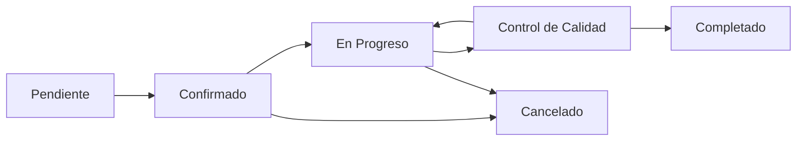
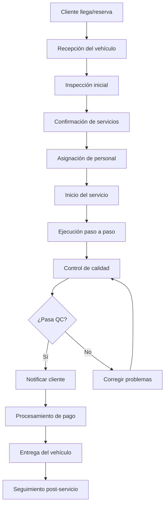

# 🚗 Car Wash - Documentación Completa

## 📋 **Información General**

**Car Wash** es el módulo especializado para la gestión completa de servicios de lavado de vehículos, diseñado para car washes, concesionarios con servicios de lavado, y empresas de detallado automotriz.

### **Ubicación en el Sistema**
- **Ruta Base**: `/car_wash`
- **Namespace**: `Modules\CarWash`
- **Controlador Principal**: `CarWashController.php`
- **Modelos**: `CarWashOrderModel`, `CarWashServiceModel`, `CarWashActivityModel`

---

## 🎯 **Funcionalidades Principales**

### **1. Gestión Completa de Órdenes de Lavado**
- ✅ **Crear Órdenes**: Formulario especializado para servicios de lavado
- ✅ **Programación**: Sistema de citas y turnos
- ✅ **Asignación de Personal**: Staff especializado por tipo de servicio
- ✅ **Seguimiento en Tiempo Real**: Estados específicos de lavado
- ✅ **Control de Calidad**: Inspección final del trabajo
- ✅ **Facturación**: Generación automática de recibos

### **2. Estados Específicos para Car Wash**


**Estados Detallados:**
- 🟡 **Pendiente**: Orden creada, esperando confirmación
- 🔵 **Confirmado**: Orden aprobada, programada
- 🟠 **En Progreso**: Servicio de lavado ejecutándose
- 🟣 **Control de Calidad**: Inspección final del trabajo
- 🟢 **Completado**: Servicio finalizado exitosamente
- 🔴 **Cancelado**: Orden cancelada por cualquier motivo

### **3. Dashboard Especializado con 6 Pestañas**
**Pestañas Principales:**
- 📊 **Dashboard**: Métricas generales y gráficos de negocio
- 📅 **Today**: Órdenes programadas para el día actual
- 📆 **This Week**: Vista semanal de órdenes (Lunes a Domingo)
- 📋 **All Orders**: Listado completo con filtros avanzados
- ⚙️ **Services**: Gestión del catálogo de servicios de lavado
- 🗑️ **Deleted**: Órdenes eliminadas (soft delete, recuperables)

---

## 🏗️ **Arquitectura del Módulo**

### **Estructura de Archivos**
```
app/Modules/CarWash/
├── Controllers/
│   ├── CarWashController.php           # Controlador principal (2,400+ líneas)
│   └── CarWashServicesController.php   # Gestión de servicios
├── Models/
│   ├── CarWashOrderModel.php           # Modelo principal de órdenes
│   ├── CarWashServiceModel.php         # Modelo de servicios
│   ├── CarWashActivityModel.php        # Modelo de actividades
│   └── CarWashCommentModel.php         # Modelo de comentarios
├── Views/
│   └── car_wash/
│       ├── index.php                   # Vista principal con tabs
│       ├── view.php                    # Vista detallada de orden
│       ├── edit.php                    # Formulario de edición
│       ├── dashboard_content.php       # Dashboard con métricas
│       ├── today_content.php           # Órdenes de hoy
│       ├── week_content.php            # Vista semanal
│       ├── all_content.php             # Todas las órdenes
│       ├── services_content.php        # Gestión de servicios
│       ├── deleted_content.php         # Órdenes eliminadas
│       └── modal_form.php              # Modal para formularios
└── Config/
    └── Routes.php                      # Rutas del módulo
```

### **Base de Datos Especializada**
**Tablas Principales:**
- `car_wash_orders` - Órdenes principales de lavado
- `car_wash_services` - Catálogo de servicios disponibles
- `car_wash_order_services` - Relación órdenes-servicios (many-to-many)
- `car_wash_activity` - Historial de actividades
- `car_wash_comments` - Sistema de comentarios

---

## 🧼 **Sistema de Servicios de Lavado**

### **Categorías de Servicios**
```yaml
Exterior:
  - Lavado Básico: Enjuague y jabón
  - Lavado Premium: Incluye encerado
  - Lavado Deluxe: Encerado + llantas + cristales
  - Detallado Exterior: Pulido y protección

Interior:
  - Aspirado Básico: Asientos y alfombras
  - Limpieza Completa: Incluye tablero y puertas
  - Detallado Interior: Limpieza profunda + protección
  - Lavado de Tapicería: Limpieza especializada

Servicio Completo:
  - Básico: Exterior + Interior básico
  - Premium: Exterior premium + Interior completo
  - Deluxe: Detallado completo
  - VIP: Servicio premium + extras

Detallado:
  - Paint Correction: Corrección de pintura
  - Ceramic Coating: Protección cerámica
  - Engine Bay: Limpieza de motor
  - Headlight Restoration: Restauración de faros

Adicionales:
  - Encerado: Protección adicional
  - Perfumado: Aromatización del vehículo
  - Protección de Llantas: Brillo y protección
  - Limpieza de Motor: Desengrase especializado
```

### **Tipos de Servicio por Complejidad**
```php
// Clasificación por tiempo y recursos
'basic' => [
    'duration' => '30 minutes',
    'staff_required' => 1,
    'price_range' => '$15-25'
],
'premium' => [
    'duration' => '45-60 minutes', 
    'staff_required' => 2,
    'price_range' => '$25-40'
],
'deluxe' => [
    'duration' => '60-90 minutes',
    'staff_required' => 2-3,
    'price_range' => '$40-60'
],
'custom' => [
    'duration' => 'Variable',
    'staff_required' => 'Variable',
    'price_range' => 'Cotización'
]
```

---

## 📊 **Dashboard y Métricas de Car Wash**

### **KPIs Principales**
- 🚗 **Órdenes Hoy**: Contador en tiempo real
- 💰 **Ingresos del Día**: Cálculo automático
- ⏱️ **Tiempo Promedio**: Por tipo de servicio
- 👥 **Staff Activo**: Personal trabajando
- 📈 **Eficiencia**: Órdenes completadas vs programadas
- 🎯 **Meta Diaria**: Progress hacia objetivo

### **Gráficos Interactivos (ApexCharts)**
```javascript
// Gráficos específicos para Car Wash
dailyOrdersChart: {
    type: 'line',
    data: 'Órdenes por día (últimos 30 días)',
    colors: ['#0066cc']
},

ordersByStatusChart: {
    type: 'donut', 
    data: 'Distribución por estados',
    colors: ['#ffc107', '#28a745', '#6f42c1', '#0066cc', '#dc3545']
},

serviceTypesChart: {
    type: 'bar',
    data: 'Servicios más populares',
    orientation: 'horizontal'
},

hourlyDistributionChart: {
    type: 'heatmap',
    data: 'Distribución por horas del día'
}
```

### **Métricas de Rendimiento**
- 📊 **Productividad por Hora**: Órdenes completadas/hora
- 💵 **Ingresos por m²**: Utilización del espacio
- ⏰ **Tiempo de Espera**: Promedio de cola
- 🔄 **Tasa de Retorno**: Clientes recurrentes
- ⭐ **Satisfacción**: Rating promedio del servicio

---

## 🕐 **Sistema de Programación y Turnos**

### **Gestión de Citas**
```php
// Sistema de slots de tiempo
$timeSlots = [
    '08:00' => ['available' => 3, 'booked' => 1],
    '08:30' => ['available' => 3, 'booked' => 2], 
    '09:00' => ['available' => 3, 'booked' => 3], // Full
    '09:30' => ['available' => 3, 'booked' => 0],
    // ... más slots
];
```

### **Características del Sistema de Turnos**
- ✅ **Slots Configurables**: Intervalos de 15/30/60 minutos
- ✅ **Capacidad por Slot**: Múltiples vehículos simultáneos
- ✅ **Reserva Anticipada**: Hasta 30 días adelante
- ✅ **Confirmación Automática**: SMS/Email de confirmación
- ✅ **Lista de Espera**: Para slots llenos
- ✅ **Recordatorios**: 24h y 2h antes del servicio

### **Vista Semanal Optimizada**
```javascript
// Calendario semanal con drag & drop
weekView: {
    days: ['Monday', 'Tuesday', 'Wednesday', 'Thursday', 'Friday', 'Saturday', 'Sunday'],
    timeSlots: ['08:00', '08:30', '09:00', ...],
    features: [
        'Drag & Drop rescheduling',
        'Color coding by service type',
        'Quick add appointments',
        'Staff assignment view'
    ]
}
```

---

## 🚙 **Información del Vehículo**

### **Datos Capturados**
```php
// Información detallada del vehículo
$vehicleInfo = [
    'make' => 'BMW',           // Marca
    'model' => 'X5',           // Modelo  
    'year' => 2023,            // Año
    'color' => 'Blanco',       // Color
    'license_plate' => 'ABC123', // Placa
    'vin' => '1HGBH41JXMN109186', // VIN (opcional)
    'notes' => 'Rayón en puerta izquierda', // Notas especiales
    'last_service' => '2024-01-15', // Último servicio
    'preferred_services' => ['exterior', 'interior'] // Preferencias
];
```

### **Historial del Vehículo**
- 📅 **Servicios Anteriores**: Lista completa con fechas
- 💰 **Gasto Total**: Suma de todos los servicios
- ⭐ **Servicios Favoritos**: Más solicitados
- 📝 **Notas Especiales**: Instrucciones específicas
- 📸 **Fotos**: Antes/después de servicios
- 🔔 **Recordatorios**: Servicios recomendados

---

## 👨‍💼 **Gestión de Personal**

### **Roles Específicos del Car Wash**
```yaml
Wash Attendant:
  - Servicios básicos de lavado
  - Aspirado interior
  - Secado del vehículo

Senior Washer:
  - Servicios premium
  - Encerado y pulido básico
  - Supervisión de attendants

Detailer:
  - Detallado completo
  - Paint correction
  - Ceramic coating
  - Servicios especializados

Supervisor:
  - Control de calidad
  - Asignación de personal
  - Resolución de problemas
  - Atención al cliente

Manager:
  - Operaciones generales
  - Programación de personal
  - Reportes y métricas
  - Capacitación de staff
```

### **Sistema de Asignación**
- ✅ **Auto-asignación**: Basada en disponibilidad y especialidad
- ✅ **Balanceo de Carga**: Distribución equitativa de trabajo
- ✅ **Preferencias**: Staff preferido por cliente
- ✅ **Habilidades**: Matching por tipo de servicio
- ✅ **Horarios**: Turnos y disponibilidad

---

## 💰 **Sistema de Precios y Facturación**

### **Estructura de Precios**
```php
// Precios dinámicos por servicio
$pricingStructure = [
    'base_price' => 25.00,
    'vehicle_size_multiplier' => [
        'compact' => 1.0,
        'sedan' => 1.1, 
        'suv' => 1.3,
        'truck' => 1.5
    ],
    'service_add_ons' => [
        'wax' => 10.00,
        'interior_protection' => 15.00,
        'engine_cleaning' => 20.00
    ],
    'peak_hour_surcharge' => 1.2, // 20% extra en horas pico
    'loyalty_discount' => 0.9     // 10% descuento clientes frecuentes
];
```

### **Promociones y Descuentos**
- 🎟️ **Cupones**: Sistema de códigos promocionales
- 💳 **Membresías**: Planes mensuales/anuales
- 🔄 **Clientes Frecuentes**: Descuentos por lealtad
- 📅 **Happy Hour**: Precios especiales en horarios específicos
- 🎉 **Promociones Especiales**: Eventos y temporadas

### **Métodos de Pago**
- 💳 **Tarjetas**: Integración con payment gateway
- 💵 **Efectivo**: Manejo de caja
- 📱 **Apps de Pago**: Apple Pay, Google Pay
- 🏪 **Crédito**: Cuentas corporativas
- 🎁 **Gift Cards**: Tarjetas de regalo

---

## 🔄 **Workflows Específicos**

### **Flujo de Orden Estándar**


### **Proceso de Control de Calidad**
```php
// Checklist de QC por tipo de servicio
$qualityChecklist = [
    'exterior' => [
        'body_clean' => 'Carrocería limpia sin residuos',
        'windows_clear' => 'Cristales sin manchas',
        'wheels_clean' => 'Llantas limpias y brillantes',
        'trim_detailed' => 'Molduras y detalles limpios'
    ],
    'interior' => [
        'vacuum_complete' => 'Aspirado completo',
        'dashboard_clean' => 'Tablero limpio y protegido', 
        'seats_clean' => 'Asientos limpios',
        'no_odors' => 'Sin olores desagradables'
    ]
];
```

---

## 📱 **Funcionalidades Móviles**

### **App para Staff**
- 📋 **Lista de Órdenes**: Órdenes asignadas del día
- ⏱️ **Time Tracking**: Registro de tiempo por servicio
- 📸 **Fotos**: Antes/durante/después del servicio
- ✅ **Checklist**: Listas de verificación por servicio
- 📞 **Comunicación**: Chat con supervisor/cliente
- 📊 **Performance**: Métricas personales del día

### **App para Clientes**
- 📅 **Reservar Cita**: Sistema de booking online
- 📍 **Tracking**: Estado del servicio en tiempo real
- 💳 **Pago**: Procesamiento de pagos móvil
- ⭐ **Rating**: Calificación del servicio
- 🔔 **Notificaciones**: Updates del progreso
- 📜 **Historial**: Servicios anteriores

---

## 📊 **Reportes Especializados**

### **Reportes Operativos**
- 📈 **Productividad Diaria**: Órdenes completadas por hora/día
- 👥 **Performance de Staff**: Métricas individuales de empleados
- 🚗 **Análisis de Servicios**: Servicios más/menos populares
- ⏰ **Tiempos de Servicio**: Comparación real vs estimado
- 💰 **Análisis de Ingresos**: Por período/servicio/staff

### **Reportes de Cliente**
- 🔄 **Retención de Clientes**: Análisis de lealtad
- 📊 **Segmentación**: Clientes por frecuencia/gasto
- ⭐ **Satisfacción**: Ratings y feedback
- 📈 **Crecimiento**: Nuevos clientes por período
- 💸 **Valor de Vida**: Customer lifetime value

### **Reportes Financieros**
- 💵 **Ingresos vs Gastos**: P&L por período
- 📊 **Margen por Servicio**: Rentabilidad detallada
- 💳 **Métodos de Pago**: Distribución de pagos
- 📈 **Tendencias**: Análisis de crecimiento
- 🎯 **Presupuesto vs Real**: Comparación con objetivos

---

## 🛠️ **Configuración del Módulo**

### **Settings Específicos**
```php
// Configuraciones del Car Wash
'car_wash_slot_duration' => 30,        // minutos por slot
'car_wash_max_daily_capacity' => 50,   // órdenes por día
'car_wash_advance_booking_days' => 30, // días adelante
'car_wash_auto_confirm' => true,       // confirmación automática
'car_wash_qc_required' => true,        // QC obligatorio
'car_wash_customer_rating' => true,    // sistema de rating
'car_wash_loyalty_points' => true,     // programa de puntos
'car_wash_peak_hours' => '10:00-14:00', // horas pico
```

### **Personalización por Negocio**
- **Tipos de Servicio**: Configurables según negocio
- **Precios**: Flexibles por tamaño/tipo de vehículo
- **Horarios**: Configuración de horarios de operación
- **Staff**: Roles y permisos personalizables
- **Promociones**: Sistema de descuentos configurable

---

## 🚨 **Sistema de Alertas**

### **Alertas Operativas**
```php
// Alertas automáticas del sistema
- queue_full: Cola de espera llena
- service_delayed: Servicio excede tiempo estimado
- staff_shortage: Personal insuficiente para demanda
- equipment_maintenance: Mantenimiento de equipos debido
- customer_waiting: Cliente esperando más de X minutos
- quality_issue: Problema en control de calidad
- payment_pending: Pagos pendientes de procesamiento
```

### **Notificaciones a Clientes**
- 📱 **Confirmación**: Cita confirmada
- ⏰ **Recordatorio**: 24h y 2h antes del servicio
- 🚗 **En Progreso**: Servicio iniciado
- ✅ **Completado**: Vehículo listo para recoger
- 💳 **Pago**: Recibo y detalles de facturación
- 📝 **Feedback**: Solicitud de calificación

---

## 🔮 **Roadmap del Módulo Car Wash**

### **Funcionalidades en Desarrollo**
- [ ] **AI Scheduling**: Optimización automática de citas
- [ ] **IoT Sensors**: Sensores para monitoreo automático
- [ ] **Subscription Model**: Planes de servicio mensual
- [ ] **Fleet Services**: Servicios para flotas comerciales
- [ ] **Eco Mode**: Tracking de uso de agua/químicos

### **Integraciones Futuras**
- [ ] **Weather API**: Ajuste de precios por clima
- [ ] **Maps Integration**: Direcciones y rutas
- [ ] **Social Media**: Compartir en redes sociales
- [ ] **Loyalty Programs**: Integración con programas existentes
- [ ] **Insurance**: Servicios cubiertos por seguro

---

## 📈 **Métricas de Éxito**

### **KPIs del Negocio**
- 💰 **Ingresos por m²**: Optimización del espacio
- ⏱️ **Tiempo Promedio de Servicio**: Eficiencia operativa
- 🔄 **Tasa de Retorno**: Lealtad del cliente
- ⭐ **Rating Promedio**: Satisfacción del cliente
- 👥 **Productividad del Staff**: Órdenes por empleado
- 📈 **Crecimiento Mensual**: Expansión del negocio

### **Benchmarks de la Industria**
- **Tiempo de Lavado Básico**: 15-30 minutos
- **Tiempo de Detallado**: 2-4 horas
- **Tasa de Satisfacción**: >90%
- **Retorno de Clientes**: >60%
- **Utilización de Capacidad**: >75%

---

**El módulo Car Wash está optimizado para maximizar la eficiencia operativa, la satisfacción del cliente y la rentabilidad del negocio, proporcionando herramientas especializadas para la industria del lavado de vehículos.**

---

*Documentación actualizada: 2025-01-19*  
*Versión del módulo: Car Wash v2.0*  
*Para más información: [Volver a Documentación Principal](../../claude.md)*


