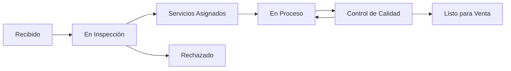
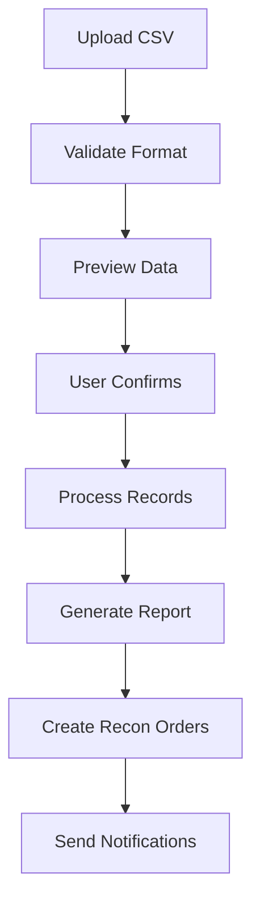

# 📋 Recon Orders - Documentación Completa

## 📋 **Información General**

**Recon Orders** es el módulo especializado para la gestión de órdenes de reconocimiento e inventario vehicular, diseñado para concesionarios que necesitan procesar, inspeccionar y preparar vehículos para la venta o servicios.

### **Ubicación en el Sistema**
- **Ruta Base**: `/recon_orders`
- **Namespace**: `Modules\ReconOrders`
- **Controlador Principal**: `ReconOrdersController.php`
- **Modelos**: `ReconOrderModel`, `ReconVehicleModel`, `ReconActivityModel`

---

## 🎯 **Funcionalidades Principales**

### **1. Gestión de Inventario Vehicular**
- ✅ **Ingreso de Vehículos**: Registro completo de vehículos nuevos
- ✅ **Inspección Inicial**: Checklist detallado de condición
- ✅ **Asignación de Servicios**: Qué servicios necesita cada vehículo
- ✅ **Tracking de Progreso**: Estados detallados del proceso
- ✅ **Preparación para Venta**: Lista de verificación final
- ✅ **Integración con CSV**: Importación masiva desde archivos

### **2. Estados del Proceso de Reconocimiento**


**Estados Detallados:**
- 🔵 **Recibido**: Vehículo ingresado al sistema
- 🟡 **En Inspección**: Evaluación inicial en progreso
- 🟠 **Servicios Asignados**: Servicios necesarios identificados
- 🟣 **En Proceso**: Servicios siendo ejecutados
- 🟤 **Control de Calidad**: Revisión final
- 🟢 **Listo para Venta**: Vehículo preparado
- 🔴 **Rechazado**: Vehículo no apto

### **3. Dashboard de Reconocimiento**
**Pestañas Disponibles:**
- 📊 **Dashboard**: Métricas del proceso de recon
- 📅 **Today**: Vehículos programados para hoy
- 📈 **In Progress**: Vehículos en proceso
- ✅ **Completed**: Vehículos completados
- ⏳ **Pending**: Vehículos pendientes de asignación
- 📋 **All Orders**: Listado completo con filtros
- 🗑️ **Deleted**: Órdenes eliminadas

---

## 🏗️ **Arquitectura del Módulo**

### **Estructura de Archivos**
```
app/Modules/ReconOrders/
├── Controllers/
│   └── ReconOrdersController.php       # Controlador principal
├── Models/
│   ├── ReconOrderModel.php            # Modelo principal
│   ├── ReconVehicleModel.php          # Modelo de vehículos
│   └── ReconActivityModel.php         # Modelo de actividades
├── Views/
│   └── recon_orders/
│       ├── index.php                  # Vista principal
│       ├── view.php                   # Vista detallada
│       ├── dashboard_content.php      # Dashboard
│       ├── today_content.php          # Vehículos de hoy
│       ├── in_progress_content.php    # En progreso
│       ├── completed_content.php      # Completados
│       ├── pending_content.php        # Pendientes
│       └── all_content.php            # Todos
└── Config/
    └── Routes.php                     # Rutas del módulo
```

### **Base de Datos**
**Tablas Principales:**
- `recon_orders` - Órdenes de reconocimiento principales
- `recon_vehicles` - Información detallada de vehículos
- `recon_services` - Servicios asignados por vehículo
- `recon_activity` - Historial de actividades
- `recon_comments` - Sistema de comentarios
- `recon_inspections` - Reportes de inspección

---

## 🔍 **Proceso de Inspección Detallado**

### **Checklist de Inspección**
```php
// Lista de verificación por categoría
$inspectionChecklist = [
    'exterior' => [
        'paint_condition' => ['excellent', 'good', 'fair', 'poor'],
        'body_damage' => ['none', 'minor', 'moderate', 'major'],
        'lights_functional' => ['all_working', 'some_issues', 'major_issues'],
        'tires_condition' => ['excellent', 'good', 'needs_replacement'],
        'glass_condition' => ['perfect', 'minor_chips', 'cracked']
    ],
    'interior' => [
        'seats_condition' => ['excellent', 'good', 'worn', 'damaged'],
        'dashboard_condition' => ['perfect', 'minor_wear', 'damaged'],
        'electronics_working' => ['all_functional', 'some_issues', 'major_issues'],
        'cleanliness' => ['clean', 'needs_cleaning', 'deep_clean_required']
    ],
    'mechanical' => [
        'engine_condition' => ['excellent', 'good', 'needs_service', 'major_issues'],
        'transmission' => ['smooth', 'minor_issues', 'needs_service'],
        'brakes' => ['excellent', 'good', 'needs_service', 'unsafe'],
        'suspension' => ['excellent', 'good', 'needs_attention', 'poor']
    ]
];
```

### **Sistema de Scoring**
```php
// Cálculo automático de score de vehículo
$vehicleScore = [
    'overall_condition' => 85,    // 0-100
    'market_readiness' => 90,     // 0-100  
    'estimated_prep_cost' => 1250.00,
    'estimated_prep_time' => 8,   // horas
    'recommended_services' => [
        'detail_cleaning',
        'minor_paint_touch_up',
        'oil_change',
        'brake_inspection'
    ]
];
```

---

## 📊 **Dashboard y Métricas de Reconocimiento**

### **KPIs Principales**
- 🚗 **Vehículos en Proceso**: Contador actual
- ⏱️ **Tiempo Promedio**: Días desde ingreso hasta listo
- 💰 **Costo Promedio de Prep**: Inversión por vehículo
- 📈 **Throughput**: Vehículos procesados por día/semana
- 🎯 **Tasa de Aprobación**: % de vehículos aprobados
- 💵 **ROI Estimado**: Retorno de inversión proyectado

### **Gráficos Especializados**
```javascript
// Gráficos específicos para Recon
reconThroughputChart: {
    type: 'line',
    data: 'Vehículos procesados por día',
    trend: 'últimos 30 días'
},

conditionDistributionChart: {
    type: 'donut',
    data: 'Distribución por condición de vehículos',
    categories: ['Excellent', 'Good', 'Fair', 'Poor']
},

prepCostChart: {
    type: 'bar',
    data: 'Costo de preparación por categoría',
    categories: ['Mechanical', 'Cosmetic', 'Detailing', 'Other']
},

timeToCompletionChart: {
    type: 'histogram',
    data: 'Distribución de tiempo de procesamiento'
}
```

---

## 📥 **Importación Masiva desde CSV**

### **Funcionalidad de Importación**
- ✅ **CSV Upload**: Carga de archivos CSV con validación
- ✅ **Mapping Fields**: Mapeo automático de campos
- ✅ **Data Validation**: Validación de datos antes de importar
- ✅ **Error Reporting**: Reporte detallado de errores
- ✅ **Preview Mode**: Vista previa antes de confirmar
- ✅ **Batch Processing**: Procesamiento por lotes

### **Estructura CSV Esperada**
```csv
stock,vin_number,vehicle,client_id,service_date,services,notes
DML001,1HGBH41JXMN109186,2023 BMW X5 xDrive40i,1,2025-01-20,"inspection,detailing,oil_change","Vehículo en excelente condición"
DML002,2HGFC2F59NH123456,2022 Honda Accord EX,1,2025-01-21,"inspection,brake_service","Necesita revisión de frenos"
```

### **Proceso de Importación**


---

## 🔧 **Servicios y Preparación**

### **Tipos de Servicios de Preparación**
```yaml
Inspección y Diagnóstico:
  - Inspección inicial completa
  - Diagnóstico mecánico
  - Evaluación de condición
  - Estimación de costos

Servicios Mecánicos:
  - Cambio de aceite y filtros
  - Revisión de frenos
  - Inspección de transmisión
  - Diagnóstico de motor
  - Alineación y balanceo

Servicios Cosméticos:
  - Detallado completo
  - Corrección de pintura
  - Reparación de abolladuras
  - Restauración de faros
  - Limpieza de motor

Preparación Final:
  - Inspección de calidad
  - Preparación de documentos
  - Fotografía para inventario
  - Pricing y marketing prep
```

### **Asignación Automática de Servicios**
```php
// Lógica de asignación basada en inspección
function assignServices($inspectionResults) {
    $services = [];
    
    if ($inspectionResults['exterior']['paint_condition'] === 'fair') {
        $services[] = 'paint_correction';
    }
    
    if ($inspectionResults['mechanical']['engine_condition'] === 'needs_service') {
        $services[] = 'engine_service';
    }
    
    if ($inspectionResults['interior']['cleanliness'] === 'deep_clean_required') {
        $services[] = 'deep_interior_cleaning';
    }
    
    return $services;
}
```

---

## 💰 **Gestión de Costos y ROI**

### **Tracking de Costos**
```php
// Estructura de costos por vehículo
$reconCosts = [
    'acquisition_cost' => 25000.00,
    'preparation_costs' => [
        'mechanical' => 850.00,
        'cosmetic' => 650.00,
        'detailing' => 300.00,
        'parts' => 450.00,
        'labor' => 600.00
    ],
    'total_investment' => 27850.00,
    'estimated_market_value' => 32000.00,
    'projected_profit' => 4150.00,
    'roi_percentage' => 14.9
];
```

### **Análisis de Rentabilidad**
- 💵 **Costo de Adquisición**: Precio de compra del vehículo
- 🔧 **Costos de Preparación**: Servicios y reparaciones
- 📊 **Valor de Mercado**: Estimación de precio de venta
- 📈 **ROI Proyectado**: Retorno de inversión esperado
- ⏱️ **Tiempo de Inversión**: Días desde compra hasta venta

---

## 📸 **Documentación Fotográfica**

### **Sistema de Fotos**
- ✅ **Fotos de Ingreso**: Estado inicial del vehículo
- ✅ **Fotos de Progreso**: Durante servicios de preparación
- ✅ **Fotos Finales**: Vehículo listo para venta
- ✅ **Comparativas**: Antes/después de servicios
- ✅ **Detalles Específicos**: Daños o características especiales

### **Organización de Fotos**
```php
// Estructura de almacenamiento de fotos
$photoStructure = [
    'intake' => [
        'exterior_front', 'exterior_rear', 'exterior_sides',
        'interior_front', 'interior_rear', 'dashboard',
        'engine_bay', 'trunk', 'damage_details'
    ],
    'progress' => [
        'work_in_progress', 'before_after_comparisons'
    ],
    'final' => [
        'marketing_shots', 'detail_shots', 'final_condition'
    ]
];
```

---

## 📋 **Reportes Especializados**

### **Reportes Operativos**
- 📊 **Throughput Report**: Vehículos procesados por período
- ⏱️ **Time Analysis**: Análisis de tiempos de procesamiento
- 💰 **Cost Analysis**: Análisis de costos de preparación
- 🎯 **Quality Metrics**: Métricas de calidad y aprobación
- 📈 **Trend Analysis**: Tendencias de mercado y demanda

### **Reportes Financieros**
- 💵 **Investment Summary**: Resumen de inversiones
- 📊 **ROI Analysis**: Análisis de retorno de inversión
- 💰 **Profit Margins**: Márgenes por tipo de vehículo
- 📈 **Performance vs Budget**: Comparación con presupuesto
- 🎯 **Forecast**: Proyecciones financieras

---

## 🔄 **Integración con Otros Módulos**

### **Conexión con Sales Orders**
- 🚗 **Vehículos Listos**: Automáticamente disponibles para venta
- 📊 **Data Transfer**: Transferencia de información completa
- 💰 **Pricing**: Precios basados en costos de recon
- 📸 **Photos**: Fotos disponibles para marketing

### **Conexión con Service Orders**
- 🔧 **Servicios Pendientes**: Servicios asignados se convierten en órdenes
- 👨‍🔧 **Técnicos**: Asignación automática basada en especialidad
- 📅 **Scheduling**: Programación de servicios
- 📊 **Progress Tracking**: Seguimiento de progreso

### **Conexión con Vehicles**
- 📍 **Location Tracking**: Ubicación durante proceso
- 📊 **Analytics**: Contribución a métricas generales
- 🔗 **Cross-Reference**: Enlaces cruzados entre módulos

---

## 🛠️ **Configuración del Módulo**

### **Settings Específicos**
```php
// Configuraciones del módulo Recon
'recon_auto_assign_services' => true,
'recon_require_photos' => true,
'recon_quality_score_threshold' => 80,
'recon_auto_create_sales_order' => true,
'recon_default_prep_time' => 5, // días
'recon_cost_tracking' => true,
'recon_roi_calculation' => true,
```

### **Personalización**
- **Checklists**: Listas de inspección personalizables
- **Servicios**: Catálogo de servicios configurable
- **Scoring**: Criterios de evaluación ajustables
- **Workflows**: Flujos de trabajo personalizables
- **Reportes**: Templates de reportes configurables

---

## 🚨 **Sistema de Alertas**

### **Alertas Operativas**
```php
// Alertas del sistema Recon
- vehicle_overdue: Vehículo excede tiempo esperado
- high_prep_cost: Costo de preparación excede límite
- quality_issue: Problema en inspección de calidad
- service_delay: Retraso en servicios asignados
- inventory_aging: Vehículo en proceso por mucho tiempo
- budget_exceeded: Presupuesto de preparación excedido
```

### **Notificaciones Automáticas**
- 📧 **Ingreso de Vehículo**: Notificación de nuevo vehículo
- ⏰ **Servicios Asignados**: Notificación a técnicos
- ✅ **Completado**: Vehículo listo para venta
- 🚨 **Alertas**: Problemas que requieren atención
- 📊 **Reportes**: Reportes programados

---

## 🔮 **Roadmap del Módulo**

### **Funcionalidades en Desarrollo**
- [ ] **AI Condition Assessment**: Evaluación automática con IA
- [ ] **Market Price Integration**: Precios de mercado en tiempo real
- [ ] **Mobile Inspection App**: App móvil para inspecciones
- [ ] **Blockchain Documentation**: Historial inmutable
- [ ] **Predictive Analytics**: Predicción de costos y tiempos

### **Integraciones Futuras**
- [ ] **Auction Integration**: Conexión con subastas
- [ ] **Parts Suppliers**: Integración con proveedores
- [ ] **Insurance**: Evaluaciones para seguros
- [ ] **Financing**: Integración con financieras
- [ ] **Market Data**: APIs de datos de mercado

---

## 📊 **Métricas de Performance**

### **KPIs del Proceso**
- ⏱️ **Average Processing Time**: 5-7 días por vehículo
- 💰 **Average Prep Cost**: $800-1,500 por vehículo
- 📈 **Throughput**: 20-30 vehículos por semana
- 🎯 **Quality Score**: >85% promedio
- 💵 **ROI**: >15% promedio
- ✅ **Completion Rate**: >95% de vehículos completados

### **Benchmarks de la Industria**
- **Tiempo de Procesamiento**: 3-10 días
- **Costo de Preparación**: 2-5% del valor del vehículo
- **Tasa de Aprobación**: 90-95%
- **ROI Objetivo**: 12-20%
- **Utilización de Capacidad**: 80-90%

---

**El módulo Recon Orders optimiza el proceso completo de reconocimiento vehicular, desde la inspección inicial hasta la preparación para venta, maximizando la eficiencia y rentabilidad del inventario.**

---

*Documentación actualizada: 2025-01-19*  
*Versión del módulo: Recon Orders v2.0*  
*Para más información: [Volver a Documentación Principal](../../claude.md)*


