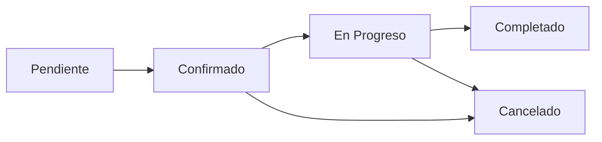
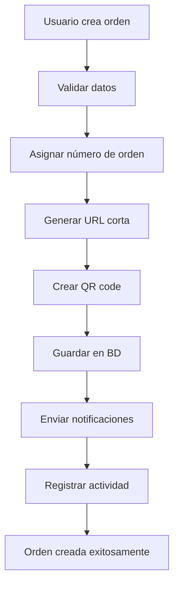
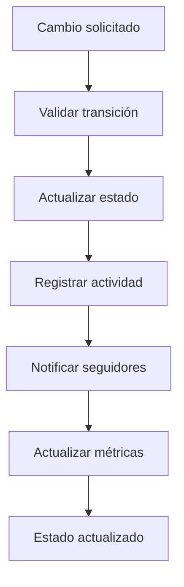

# 🛒 Sales Orders - Documentación Completa

## 📋 **Información General**

**Sales Orders** es el módulo principal del sistema MDA, diseñado para gestionar el ciclo completo de órdenes de venta en concesionarios automotrices y empresas de servicios vehiculares.

### **Ubicación en el Sistema**
- **Ruta Base**: `/sales_orders`
- **Namespace**: `Modules\SalesOrders`
- **Controlador Principal**: `SalesOrdersController.php`
- **Modelos**: `SalesOrderModel`, `SalesOrderServiceModel`, `OrderActivityModel`

---

## 🎯 **Funcionalidades Principales**

### **1. Gestión Completa de Órdenes (CRUD)**
- ✅ **Crear Órdenes**: Formulario completo con validaciones
- ✅ **Editar Órdenes**: Modificación con tracking de cambios
- ✅ **Visualizar Órdenes**: Vista detallada con historial
- ✅ **Eliminar Órdenes**: Soft delete con posibilidad de restaurar
- ✅ **Duplicar Órdenes**: Clonación rápida de órdenes existentes

### **2. Sistema de Estados Avanzado**


**Estados Disponibles:**
- 🟡 **Pendiente**: Orden creada, esperando confirmación
- 🔵 **Confirmado**: Orden aprobada, lista para ejecución
- 🟠 **En Progreso**: Orden siendo ejecutada
- 🟢 **Completado**: Orden finalizada exitosamente
- 🔴 **Cancelado**: Orden cancelada por cualquier motivo

### **3. Dashboard Interactivo**
**Pestañas Disponibles:**
- 📊 **Dashboard**: Métricas generales y gráficos
- 📅 **Today**: Órdenes programadas para hoy
- 📆 **Tomorrow**: Órdenes programadas para mañana  
- ⏳ **Pending**: Órdenes pendientes de confirmación
- 📈 **This Week**: Vista semanal de órdenes
- 📋 **All Orders**: Listado completo con filtros avanzados
- 🗑️ **Deleted**: Órdenes eliminadas (recuperables)

---

## 🏗️ **Arquitectura del Módulo**

### **Estructura de Archivos**
```
app/Modules/SalesOrders/
├── Controllers/
│   └── SalesOrdersController.php    # Controlador principal (7,181 líneas)
├── Models/
│   ├── SalesOrderModel.php          # Modelo principal de órdenes
│   ├── SalesOrderServiceModel.php   # Modelo de servicios
│   └── OrderActivityModel.php       # Modelo de actividades
├── Views/
│   └── sales_orders/
│       ├── index.php               # Vista principal con tabs
│       ├── view.php                # Vista detallada de orden
│       ├── edit.php                # Formulario de edición
│       ├── dashboard_content.php   # Dashboard con métricas
│       ├── today_content.php       # Órdenes de hoy
│       ├── tomorrow_content.php    # Órdenes de mañana
│       ├── pending_content.php     # Órdenes pendientes
│       ├── week_content.php        # Vista semanal
│       ├── all_content.php         # Todas las órdenes
│       └── deleted_content.php     # Órdenes eliminadas
└── Config/
    └── Routes.php                  # Rutas del módulo
```

### **Base de Datos**
**Tablas Principales:**
- `sales_orders` - Órdenes principales
- `sales_orders_services` - Catálogo de servicios
- `order_activity` - Historial de actividades
- `sales_order_comments` - Sistema de comentarios
- `sales_order_followers` - Sistema de seguidores

---

## 📊 **Dashboard y Métricas**

### **KPIs Principales**
- **Órdenes Hoy**: Contador en tiempo real
- **Órdenes Esta Semana**: Tendencia semanal
- **Órdenes Pendientes**: Requieren atención
- **Ingresos del Mes**: Cálculo automático
- **Promedio de Tiempo**: Por tipo de servicio
- **Tasa de Completado**: Porcentaje de éxito

### **Gráficos Interactivos (ApexCharts)**
- **Gráfico de Líneas**: Órdenes por día (últimos 30 días)
- **Gráfico de Donut**: Distribución por estados
- **Gráfico de Barras**: Órdenes por cliente
- **Gráfico de Área**: Ingresos mensuales
- **Heatmap**: Actividad por día de la semana

### **Filtros Avanzados**
```javascript
// Filtros disponibles en All Orders
- Por Cliente: Dropdown de clientes activos
- Por Estado: Multiple select de estados
- Por Fecha: Date range picker
- Por Servicio: Filtro por tipo de servicio
- Por Asignado: Filtro por staff asignado
- Por Prioridad: Alta, Media, Baja
- Búsqueda Global: Texto libre en todos los campos
```

---

## 🔧 **Funcionalidades Técnicas Avanzadas**

### **1. Generación de PDF Profesionales**
**Características:**
- ✅ **Motor Principal**: wkhtmltopdf para calidad superior
- ✅ **Fallback**: TCPDF para compatibilidad
- ✅ **Templates Modernos**: Diseño profesional responsive
- ✅ **QR Codes Integrados**: Enlaces directos a la orden
- ✅ **Información Completa**: Cliente, vehículo, servicios, precios
- ✅ **Branding**: Logo y colores personalizables

**Proceso de Generación:**
```php
1. Obtener datos de la orden
2. Generar QR code con URL corta
3. Renderizar template HTML
4. Convertir a PDF con wkhtmltopdf
5. Aplicar watermarks si es necesario
6. Enviar al navegador o guardar en S3
```

### **2. Sistema de QR Codes Dinámicos**
**Proveedores Múltiples:**
- **Primario**: MDA.to API (URLs cortas personalizadas)
- **Secundario**: QR Server API (servicio gratuito)
- **Características**: URLs estáticas, slugs de 5 dígitos, tracking

**Flujo de Generación:**
```php
// Ejemplo de generación de QR
$qrData = [
    'short_url' => 'https://mda.to/AB123',
    'qr_url' => 'https://api.qrserver.com/v1/create-qr-code/?data=...',
    'order_url' => 'https://sistema.com/sales_orders/view/123',
    'is_static' => true,
    'provider' => 'MDA Links API'
];
```

### **3. Sistema de Notificaciones Inteligentes**
**Canales de Notificación:**
- 📧 **Email**: Templates personalizables por evento
- 📱 **SMS**: Integración con Twilio bidireccional
- 🔔 **Push**: Notificaciones web en tiempo real
- 💬 **Chat**: Mensajes internos del sistema

**Eventos que Disparan Notificaciones:**
- Nueva orden creada
- Cambio de estado de orden
- Orden asignada a técnico
- Comentario agregado
- Archivo adjunto agregado
- Fecha de vencimiento próxima

### **4. Sistema de Comentarios y Actividades**
**Características:**
- ✅ **Comentarios Jerárquicos**: Respuestas anidadas
- ✅ **Menciones**: @usuario para notificaciones directas
- ✅ **Archivos Adjuntos**: Imágenes, documentos, videos
- ✅ **Timestamps**: Fecha y hora exacta
- ✅ **Edición**: Modificación con historial
- ✅ **Eliminación**: Soft delete con auditoría

**Timeline de Actividades:**
```php
// Tipos de actividades automáticas
- order_created: Orden creada
- status_changed: Estado modificado
- assigned_to: Asignación de personal
- comment_added: Nuevo comentario
- file_uploaded: Archivo adjunto
- pdf_generated: PDF generado
- email_sent: Email enviado
- sms_sent: SMS enviado
```

---

## 🚀 **Workflows y Procesos de Negocio**

### **Flujo de Creación de Orden**


### **Flujo de Cambio de Estado**


### **Proceso de Asignación**
1. **Selección de Personal**: Dropdown de usuarios activos
2. **Validación de Disponibilidad**: Verificar carga de trabajo
3. **Asignación**: Actualizar campo assigned_to
4. **Notificación**: Email/SMS al asignado
5. **Actividad**: Registro en timeline
6. **Dashboard**: Actualización de métricas

---

## 👥 **Roles y Permisos**

### **Permisos por Rol**
```yaml
Super Admin:
  - Todas las operaciones
  - Configuración del módulo
  - Acceso a órdenes eliminadas
  - Reportes avanzados

Admin:
  - CRUD completo de órdenes
  - Asignación de personal
  - Generación de reportes
  - Gestión de servicios

Manager:
  - Crear y editar órdenes
  - Ver todas las órdenes
  - Asignar personal
  - Aprobar cambios de estado

Staff:
  - Crear órdenes
  - Editar órdenes asignadas
  - Cambiar estado (limitado)
  - Agregar comentarios

Client:
  - Ver órdenes propias
  - Agregar comentarios
  - Descargar PDFs
  - Recibir notificaciones
```

### **Restricciones de Acceso**
- **Filtro por Cliente**: Los usuarios client solo ven sus órdenes
- **Filtro por Asignación**: Staff ve órdenes asignadas + creadas por ellos
- **Auditoría**: Todas las acciones se registran con usuario y timestamp
- **Soft Delete**: Solo admins pueden eliminar permanentemente

---

## 📈 **Métricas y Reportes**

### **Reportes Disponibles**
- 📊 **Reporte de Productividad**: Órdenes por usuario/período
- 💰 **Reporte de Ingresos**: Análisis financiero detallado
- ⏱️ **Reporte de Tiempos**: Tiempo promedio por tipo de servicio
- 📈 **Reporte de Tendencias**: Análisis de crecimiento
- 🎯 **Reporte de Satisfacción**: Métricas de calidad

### **Exportación de Datos**
```php
// Formatos disponibles
- PDF: Reportes profesionales con gráficos
- Excel: Datos tabulares para análisis
- CSV: Importación a otros sistemas
- JSON: API para integraciones
```

### **Automatización de Reportes**
- **Reportes Programados**: Envío automático por email
- **Alertas**: Notificaciones por métricas críticas
- **Dashboard Real-time**: Actualización automática cada 30 segundos

---

## 🔗 **Integraciones Específicas del Módulo**

### **Integración con Otros Módulos**
- **Service Orders**: Órdenes de seguimiento post-venta
- **Car Wash**: Servicios de lavado complementarios
- **Vehicles**: Información detallada del vehículo
- **Recon Orders**: Historial de reconocimiento

### **APIs Externas**
- **Twilio SMS**: Notificaciones automáticas
- **AWS S3**: Storage de archivos adjuntos
- **MDA.to Links**: URLs cortas personalizadas
- **Email Service**: SMTP para notificaciones

### **Webhooks Disponibles**
```php
// Endpoints para integraciones
POST /api/sales-orders/webhook/created
POST /api/sales-orders/webhook/updated
POST /api/sales-orders/webhook/completed
POST /api/sales-orders/webhook/cancelled
```

---

## 🛠️ **Configuración del Módulo**

### **Settings Específicos**
```php
// Configuraciones en Settings
sales_orders_auto_assign: true
sales_orders_notification_email: true
sales_orders_notification_sms: true
sales_orders_pdf_watermark: false
sales_orders_qr_size: 300
sales_orders_default_status: 'pending'
sales_orders_auto_number: true
sales_orders_number_prefix: 'SO-'
```

### **Personalización**
- **Templates de Email**: Personalizables por evento
- **Templates de SMS**: Variables dinámicas
- **PDF Templates**: Diseño personalizable
- **Estados Personalizados**: Configurables por empresa
- **Campos Adicionales**: Sistema extensible

---

## 🚨 **Manejo de Errores y Logging**

### **Logging Detallado**
```php
// Tipos de logs generados
- INFO: Operaciones exitosas
- WARNING: Situaciones atípicas
- ERROR: Errores de sistema
- DEBUG: Información de desarrollo
```

### **Manejo de Errores**
- **Validación de Datos**: Mensajes específicos por campo
- **Errores de BD**: Rollback automático de transacciones
- **Errores de API**: Fallbacks para servicios externos
- **Errores de PDF**: Generación alternativa con TCPDF

---

## 📱 **Optimización Móvil**

### **Responsive Design**
- ✅ **Bootstrap 5**: Framework responsive nativo
- ✅ **Modales Móviles**: 80% de pantalla en móviles
- ✅ **Touch Friendly**: Botones y controles optimizados
- ✅ **Carga Rápida**: Lazy loading de imágenes
- ✅ **Offline Support**: Caché de datos críticos

### **PWA Features**
- **Service Worker**: Caché inteligente
- **App Manifest**: Instalación como app
- **Push Notifications**: Notificaciones nativas
- **Offline Mode**: Funcionalidad básica sin internet

---

## 🔮 **Roadmap del Módulo**

### **Próximas Funcionalidades**
- [ ] **AI Assistant**: Chatbot para soporte
- [ ] **Advanced Analytics**: Machine Learning
- [ ] **Mobile App**: App nativa iOS/Android
- [ ] **Voice Commands**: Comandos por voz
- [ ] **Blockchain**: Auditoría inmutable

### **Mejoras Planificadas**
- [ ] **Performance**: Optimización de queries
- [ ] **UI/UX**: Rediseño de interfaz
- [ ] **API v2**: REST API completa
- [ ] **Multi-tenant**: Soporte múltiples empresas
- [ ] **Integraciones**: Más APIs externas

---

**Este módulo es el corazón del sistema MDA, proporcionando la funcionalidad principal para gestión de órdenes de venta con capacidades avanzadas de seguimiento, notificaciones y reportes.**

---

*Documentación actualizada: 2025-01-19*  
*Versión del módulo: Sales Orders v2.0*  
*Para más información: [Volver a Documentación Principal](../../claude.md)*

