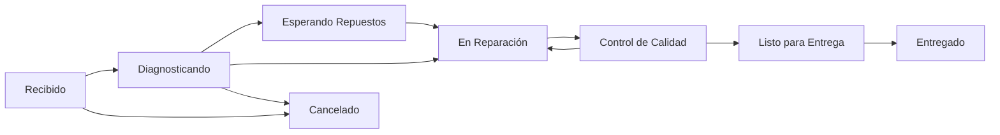
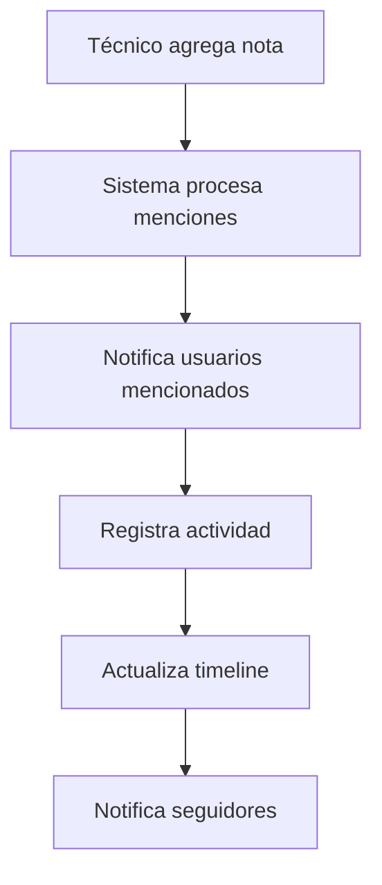
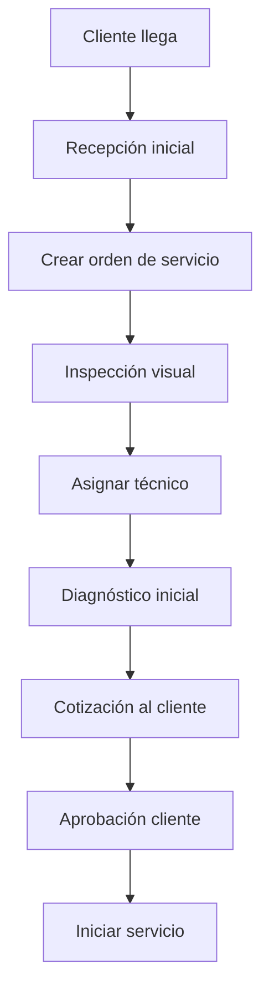
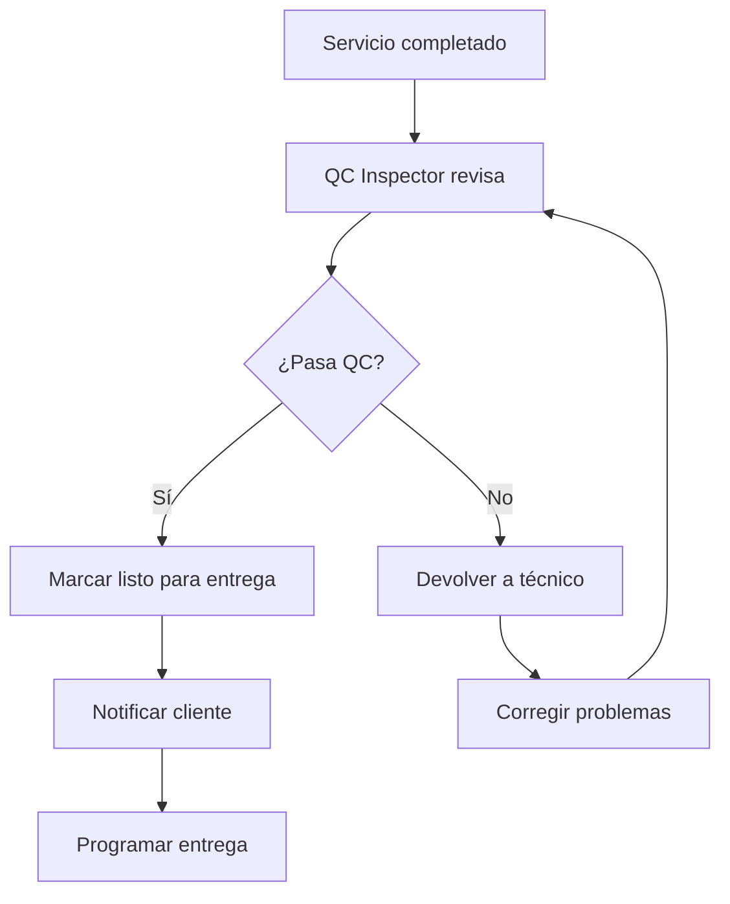

# 🔧 Service Orders - Documentación Completa

## 📋 **Información General**

**Service Orders** es el módulo especializado para la gestión de órdenes de servicio técnico, diseñado específicamente para talleres, concesionarios y empresas que brindan servicios de mantenimiento y reparación vehicular.

### **Ubicación en el Sistema**
- **Ruta Base**: `/service_orders`
- **Namespace**: `Modules\ServiceOrders`
- **Controlador Principal**: `ServiceOrdersController.php`
- **Modelos**: `ServiceOrderModel`, `ServiceOrderServiceModel`, `ServiceOrderActivityModel`

---

## 🎯 **Funcionalidades Principales**

### **1. Gestión Completa de Órdenes de Servicio**
- ✅ **Crear Órdenes**: Formulario técnico especializado
- ✅ **Asignación de Técnicos**: Sistema de asignación inteligente
- ✅ **Seguimiento en Tiempo Real**: Estados detallados del progreso
- ✅ **Control de Calidad**: Sistema de revisiones y aprobaciones
- ✅ **Gestión de Repuestos**: Inventario integrado
- ✅ **Facturación**: Generación automática de documentos

### **2. Estados Específicos para Servicios Técnicos**


**Estados Detallados:**
- 🔵 **Recibido**: Vehículo ingresado al taller
- 🟡 **Diagnosticando**: Evaluación inicial del problema
- 🟠 **Esperando Repuestos**: Aguardando llegada de partes
- 🟣 **En Reparación**: Trabajo técnico en progreso
- 🟤 **Control de Calidad**: Revisión final del trabajo
- 🟢 **Listo para Entrega**: Servicio completado
- ✅ **Entregado**: Vehículo entregado al cliente
- 🔴 **Cancelado**: Servicio cancelado

### **3. Dashboard Especializado para Talleres**
**Pestañas Específicas:**
- 🏭 **Workshop**: Vista general del taller
- 👨‍🔧 **Technicians**: Asignaciones por técnico
- 📅 **Today**: Servicios programados para hoy
- 📆 **This Week**: Planificación semanal
- ⏳ **Pending**: Órdenes pendientes de asignación
- 🔧 **In Progress**: Servicios en ejecución
- ✅ **Completed**: Servicios completados
- 📋 **All Orders**: Listado completo con filtros

---

## 🏗️ **Arquitectura del Módulo**

### **Estructura de Archivos**
```
app/Modules/ServiceOrders/
├── Controllers/
│   ├── ServiceOrdersController.php     # Controlador principal
│   ├── ServiceOrderNotesController.php # Gestión de notas
│   └── ServiceOrderFollowersController.php # Sistema de seguidores
├── Models/
│   ├── ServiceOrderModel.php           # Modelo principal
│   ├── ServiceOrderServiceModel.php    # Servicios técnicos
│   ├── ServiceOrderNoteModel.php       # Notas internas
│   ├── ServiceOrderFollowerModel.php   # Seguidores
│   └── ServiceOrderActivityModel.php   # Actividades
├── Services/
│   └── FollowerNotificationService.php # Notificaciones a seguidores
├── Views/
│   └── service_orders/
│       ├── index.php                   # Vista principal
│       ├── view.php                    # Vista detallada
│       ├── workshop_content.php        # Vista de taller
│       ├── technicians_content.php     # Vista por técnicos
│       ├── today_content.php           # Servicios de hoy
│       ├── week_content.php            # Vista semanal
│       ├── pending_content.php         # Pendientes
│       ├── in_progress_content.php     # En progreso
│       ├── completed_content.php       # Completados
│       └── all_content.php             # Todos los servicios
└── Config/
    └── Routes.php                      # Rutas del módulo
```

### **Base de Datos Especializada**
**Tablas Principales:**
- `service_orders` - Órdenes de servicio principales
- `service_orders_services` - Catálogo de servicios técnicos
- `service_order_notes` - Sistema de notas jerárquicas
- `service_order_followers` - Sistema de seguidores
- `service_order_activity` - Historial de actividades técnicas
- `service_order_parts` - Repuestos utilizados
- `service_order_labor` - Horas de trabajo por técnico

---

## 👨‍🔧 **Sistema de Técnicos y Asignaciones**

### **Gestión de Técnicos**
```php
// Tipos de técnicos en el sistema
- Master Technician: Servicios complejos
- Senior Technician: Servicios avanzados
- Junior Technician: Servicios básicos
- Specialist: Servicios especializados (transmisión, motor, etc.)
- Apprentice: En entrenamiento
```

### **Sistema de Asignación Inteligente**
**Criterios de Asignación:**
- ✅ **Especialización**: Matching por tipo de servicio
- ✅ **Carga de Trabajo**: Balanceo automático
- ✅ **Disponibilidad**: Horarios y turnos
- ✅ **Experiencia**: Nivel técnico requerido
- ✅ **Ubicación**: Zona del taller asignada
- ✅ **Herramientas**: Disponibilidad de equipos

### **Dashboard por Técnico**
```javascript
// Métricas por técnico
- Órdenes Asignadas: Contador actual
- Órdenes Completadas: Hoy/semana/mes
- Tiempo Promedio: Por tipo de servicio
- Calificación: Basada en QC y cliente
- Eficiencia: Tiempo real vs estimado
- Especialidades: Tipos de servicio
```

---

## 🔧 **Sistema de Servicios Técnicos**

### **Catálogo de Servicios**
**Categorías Principales:**
```yaml
Mantenimiento Preventivo:
  - Cambio de aceite y filtros
  - Revisión de frenos
  - Alineación y balanceo
  - Inspección general

Reparaciones Mecánicas:
  - Motor y transmisión
  - Sistema de frenos
  - Suspensión y dirección
  - Sistema eléctrico

Servicios Especializados:
  - Aire acondicionado
  - Sistema de escape
  - Inyección electrónica
  - Diagnóstico computarizado

Carrocería y Pintura:
  - Reparación de abolladuras
  - Pintura parcial/completa
  - Cambio de cristales
  - Detallado interior
```

### **Estimación de Tiempos**
```php
// Sistema de estimación automática
$estimatedTime = calculateServiceTime([
    'service_type' => 'brake_repair',
    'vehicle_make' => 'BMW',
    'vehicle_year' => 2020,
    'technician_level' => 'senior',
    'complexity' => 'medium'
]);
```

### **Control de Repuestos**
- ✅ **Inventario en Tiempo Real**: Stock disponible
- ✅ **Orden Automática**: Cuando stock es bajo
- ✅ **Proveedores**: Múltiples proveedores por repuesto
- ✅ **Precios**: Actualización automática
- ✅ **Garantías**: Tracking de garantías por repuesto

---

## 📝 **Sistema de Notas Jerárquicas**

### **Características del Sistema**
- ✅ **Notas Anidadas**: Respuestas a respuestas (ilimitado)
- ✅ **Tipos de Notas**: Técnicas, administrativas, cliente
- ✅ **Privacidad**: Notas internas vs visibles al cliente
- ✅ **Menciones**: @usuario para notificaciones
- ✅ **Archivos Adjuntos**: Fotos, diagramas, documentos
- ✅ **Timestamps**: Fecha/hora exacta con timezone

### **Flujo de Comunicación**


### **Tipos de Notas**
```php
// Clasificación de notas
'technical' => 'Nota técnica del servicio',
'admin' => 'Nota administrativa',
'client' => 'Comunicación con cliente',
'internal' => 'Nota interna del taller',
'quality' => 'Nota de control de calidad',
'parts' => 'Nota sobre repuestos'
```

---

## 👥 **Sistema de Seguidores (Followers)**

### **Funcionalidad de Seguimiento**
- ✅ **Auto-seguimiento**: Creador y asignado automáticamente
- ✅ **Seguimiento Manual**: Agregar/remover seguidores
- ✅ **Notificaciones**: Email/SMS/Push por cambios
- ✅ **Filtros**: Tipos de eventos a seguir
- ✅ **Grupos**: Seguimiento por departamento

### **Eventos que Disparan Notificaciones**
```php
// Eventos de notificación a seguidores
- status_changed: Cambio de estado
- technician_assigned: Asignación de técnico
- note_added: Nueva nota agregada
- file_uploaded: Archivo adjunto
- quality_check: Control de calidad
- ready_for_delivery: Listo para entrega
- customer_contacted: Cliente contactado
```

### **FollowerNotificationService**
```php
// Servicio especializado para notificaciones
class FollowerNotificationService {
    public function notifyFollowers($orderId, $event, $data);
    public function addFollower($orderId, $userId);
    public function removeFollower($orderId, $userId);
    public function getFollowers($orderId);
}
```

---

## 📊 **Dashboard y Métricas de Taller**

### **Vista Workshop (Taller)**
**Métricas en Tiempo Real:**
- 🚗 **Vehículos en Taller**: Contador actual
- 👨‍🔧 **Técnicos Activos**: Personal trabajando
- ⏱️ **Tiempo Promedio**: Por tipo de servicio
- 📈 **Eficiencia**: Comparación tiempo real vs estimado
- 💰 **Ingresos del Día**: Servicios completados
- 📋 **Cola de Trabajo**: Servicios pendientes

### **Gráficos Especializados**
```javascript
// Gráficos específicos para talleres
- Gantt Chart: Timeline de servicios por técnico
- Heat Map: Ocupación del taller por horas
- Pie Chart: Distribución de tipos de servicio
- Line Chart: Tendencia de eficiencia
- Bar Chart: Productividad por técnico
```

### **Alertas del Sistema**
- 🚨 **Servicios Atrasados**: Exceden tiempo estimado
- ⚠️ **Repuestos Faltantes**: Stock bajo crítico
- 📞 **Cliente Esperando**: Servicios listos sin contactar
- 🔧 **Herramientas**: Mantenimiento de equipos debido
- 👨‍🔧 **Técnicos**: Sobrecarga de trabajo

---

## 🔄 **Workflows Específicos del Taller**

### **Flujo de Recepción de Vehículo**


### **Flujo de Control de Calidad**


### **Proceso de Entrega**
1. **Preparación**: Limpieza final del vehículo
2. **Documentación**: Generar factura y garantías
3. **Contacto**: Llamar al cliente para entrega
4. **Inspección Final**: Cliente revisa el trabajo
5. **Pago**: Procesar pago del servicio
6. **Entrega**: Entregar llaves y documentos
7. **Seguimiento**: Llamada post-servicio (opcional)

---

## 💰 **Sistema de Facturación y Costos**

### **Cálculo Automático de Costos**
```php
// Estructura de costos
$serviceCost = [
    'labor' => [
        'hours' => 2.5,
        'rate' => 75.00,
        'total' => 187.50
    ],
    'parts' => [
        'oil_filter' => 25.00,
        'oil' => 45.00,
        'air_filter' => 35.00,
        'total' => 105.00
    ],
    'tax' => 29.25,
    'total' => 321.75
];
```

### **Tipos de Facturación**
- **Por Hora**: Servicios de diagnóstico
- **Precio Fijo**: Servicios estándar
- **Por Kilometraje**: Servicios basados en uso
- **Cotización**: Servicios complejos
- **Garantía**: Servicios cubiertos

### **Integración Contable**
- ✅ **Export a QuickBooks**: Integración directa
- ✅ **Export a Excel**: Para contabilidad manual
- ✅ **Reportes Fiscales**: IVA y retenciones
- ✅ **Análisis de Rentabilidad**: Por servicio/técnico

---

## 📱 **Aplicación Móvil para Técnicos**

### **Funcionalidades Móviles**
- 📱 **Vista de Órdenes**: Órdenes asignadas
- 📸 **Captura de Fotos**: Antes/durante/después
- ⏱️ **Time Tracking**: Registro de tiempo real
- 📝 **Notas Rápidas**: Voz a texto
- 🔧 **Checklist**: Listas de verificación
- 📞 **Contacto Directo**: Llamar al cliente

### **Características Offline**
- 💾 **Caché Local**: Órdenes descargadas
- 📸 **Fotos Offline**: Sincronización posterior
- ⏱️ **Time Tracking**: Funciona sin conexión
- 📝 **Notas**: Guardado local
- 🔄 **Sync Automático**: Al recuperar conexión

---

## 📈 **Reportes Especializados**

### **Reportes Operativos**
- 📊 **Productividad por Técnico**: Horas/servicios/eficiencia
- 💰 **Análisis de Rentabilidad**: Por servicio/cliente/período
- ⏱️ **Tiempos de Servicio**: Real vs estimado
- 🔧 **Utilización de Herramientas**: Uso de equipos
- 📈 **Tendencias de Demanda**: Servicios más solicitados

### **Reportes de Calidad**
- ⭐ **Satisfacción del Cliente**: Encuestas post-servicio
- 🔄 **Índice de Retrabajo**: Servicios que regresan
- 👨‍🔧 **Performance de Técnicos**: Calidad vs velocidad
- 📋 **Cumplimiento de Checklist**: Procedimientos seguidos
- 🛡️ **Reclamaciones de Garantía**: Tracking de problemas

### **Reportes Financieros**
- 💵 **Ingresos por Período**: Diario/semanal/mensual
- 📊 **Análisis de Márgenes**: Por tipo de servicio
- 💳 **Métodos de Pago**: Efectivo/tarjeta/crédito
- 📈 **Crecimiento de Clientes**: Nuevos vs recurrentes
- 💰 **Cuentas por Cobrar**: Servicios pendientes de pago

---

## 🔧 **Configuración Avanzada del Módulo**

### **Settings Específicos de Taller**
```php
// Configuraciones especializadas
'service_orders_auto_assign' => true,
'service_orders_qc_required' => true,
'service_orders_customer_approval' => 500.00, // Monto mínimo
'service_orders_warranty_days' => 90,
'service_orders_followup_days' => 7,
'service_orders_late_threshold' => 2, // horas
'service_orders_efficiency_target' => 85, // porcentaje
```

### **Personalización por Taller**
- **Tipos de Servicio**: Configurables por empresa
- **Estados Personalizados**: Workflow adaptable
- **Plantillas**: Checklists personalizados
- **Tarifas**: Por tipo de técnico/servicio
- **Horarios**: Turnos y disponibilidad

---

## 🚨 **Sistema de Alertas y Monitoreo**

### **Alertas Automáticas**
```php
// Tipos de alertas del sistema
- service_overdue: Servicio excede tiempo estimado
- parts_shortage: Repuestos insuficientes
- technician_overload: Técnico sobrecargado
- quality_issue: Falla en control de calidad
- customer_waiting: Cliente no contactado
- equipment_maintenance: Mantenimiento de herramientas
```

### **Dashboard de Monitoreo**
- 🚨 **Alertas Activas**: Lista de situaciones críticas
- 📊 **KPIs en Tiempo Real**: Métricas clave actualizadas
- 🎯 **Objetivos**: Progress hacia metas mensuales
- 📈 **Tendencias**: Gráficos de performance
- ⚡ **Acciones Rápidas**: Botones para resolver alertas

---

## 🔮 **Roadmap del Módulo Service Orders**

### **Funcionalidades en Desarrollo**
- [ ] **AI Diagnostic**: Asistente IA para diagnósticos
- [ ] **AR Instructions**: Instrucciones de realidad aumentada
- [ ] **IoT Integration**: Sensores en herramientas
- [ ] **Predictive Maintenance**: Mantenimiento predictivo
- [ ] **Customer Portal**: Portal self-service

### **Integraciones Futuras**
- [ ] **OEM Integration**: Conexión con fabricantes
- [ ] **Parts Suppliers**: Integración con proveedores
- [ ] **Insurance**: Conexión con aseguradoras
- [ ] **Fleet Management**: Gestión de flotas
- [ ] **Telematics**: Datos del vehículo en tiempo real

---

**El módulo Service Orders está diseñado específicamente para optimizar las operaciones de talleres y centros de servicio, proporcionando herramientas avanzadas para gestión de técnicos, control de calidad y satisfacción del cliente.**

---

*Documentación actualizada: 2025-01-19*  
*Versión del módulo: Service Orders v2.0*  
*Para más información: [Volver a Documentación Principal](../../claude.md)*

