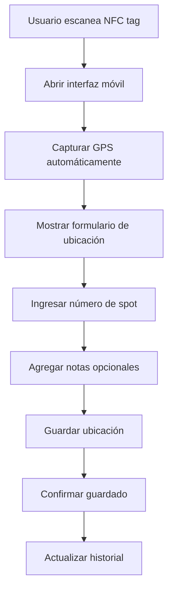

# 🚙 Vehicles - Documentación Completa

## 📋 **Información General**

**Vehicles** es el módulo centralizado para la gestión integral de vehículos, diseñado como el hub principal para tracking, analytics y gestión de ubicación de toda la flota vehicular en el sistema MDA.

### **Ubicación en el Sistema**
- **Ruta Base**: `/vehicles`
- **Namespace**: `Modules\Vehicles`
- **Controlador Principal**: `VehiclesController.php`
- **Integración**: Con todos los demás módulos (Sales, Service, CarWash, Recon)

---

## 🎯 **Funcionalidades Principales**

### **1. Dashboard Centralizado de Vehículos**
- ✅ **Vista Unificada**: Todos los vehículos del sistema en un lugar
- ✅ **Analytics Avanzados**: Métricas y gráficos interactivos
- ✅ **Filtros Inteligentes**: Búsqueda multi-criterio
- ✅ **Exportación**: Datos en múltiples formatos
- ✅ **Integración Cross-Module**: Datos de todos los módulos

### **2. Sistema NFC de Ubicación Avanzado**
- ✅ **Tokens Únicos**: 64 caracteres por vehículo
- ✅ **Interfaz Móvil**: Optimizada para tablets/smartphones
- ✅ **GPS Automático**: Captura de coordenadas en tiempo real
- ✅ **Historial Completo**: Timeline de ubicaciones
- ✅ **QR Codes**: Para fácil acceso móvil

### **3. Dashboard con 5 Pestañas Especializadas**
**Pestañas Principales:**
- 📊 **Dashboard**: Métricas generales y KPIs
- 🚗 **All Vehicles**: Listado completo con filtros avanzados
- 🕒 **Recent**: Vehículos agregados recientemente
- ✅ **Active**: Vehículos activos en el sistema
- 📍 **Location Tracking**: Sistema de ubicación NFC
- 📈 **Analytics**: Análisis avanzado con gráficos

---

## 🏗️ **Arquitectura del Módulo**

### **Estructura de Archivos**
```
app/Modules/Vehicles/
├── Controllers/
│   └── VehiclesController.php          # Controlador principal
├── Models/
│   ├── VehicleModel.php               # Modelo principal (integración)
│   └── VehicleLocationModel.php       # Modelo de ubicaciones
├── Views/
│   └── vehicles/
│       ├── index.php                  # Vista principal con tabs
│       ├── view.php                   # Vista detallada de vehículo
│       ├── dashboard_content.php      # Dashboard con métricas
│       ├── all_vehicles_content.php   # Todos los vehículos
│       ├── recent_content.php         # Vehículos recientes
│       ├── active_content.php         # Vehículos activos
│       ├── location_tracking_content.php # Sistema NFC
│       └── analytics_content.php      # Analytics avanzado
└── Config/
    └── Routes.php                     # Rutas del módulo
```

### **Base de Datos Integrada**
**Tablas Principales:**
- `recon_vehicles` - Datos principales de vehículos (tabla maestra)
- `vehicle_orders` - Relación vehículo-órdenes (cross-module)
- `vehicle_shortlinks` - URLs cortas por vehículo
- `vehicle_location_tokens` - Tokens NFC únicos
- `vehicle_locations` - Historial de ubicaciones GPS
- `parking_spots` - Catálogo de espacios de estacionamiento

**Integración Cross-Module:**
```sql
-- El módulo Vehicles integra datos de:
SELECT v.*, 
       so.sales_orders_count,
       svo.service_orders_count, 
       cw.car_wash_count,
       ro.recon_orders_count
FROM recon_vehicles v
LEFT JOIN (SELECT vehicle_id, COUNT(*) as sales_orders_count FROM sales_orders GROUP BY vehicle_id) so ON v.id = so.vehicle_id
LEFT JOIN (SELECT vehicle_id, COUNT(*) as service_orders_count FROM service_orders GROUP BY vehicle_id) svo ON v.id = svo.vehicle_id
-- ... más joins
```

---

## 📊 **Dashboard y Analytics Avanzados**

### **KPIs Principales**
- 🚗 **Total Vehículos**: Contador global del sistema
- 📈 **Vehículos Activos**: Con órdenes recientes
- 📍 **Con Ubicación**: Vehículos con tracking NFC
- 🔧 **En Servicio**: Actualmente en talleres
- 💰 **Valor Total**: Suma del valor de la flota
- 📊 **Utilización**: Porcentaje de vehículos activos

### **Gráficos Especializados (ApexCharts)**
```javascript
// Gráficos específicos para vehículos
vehicleMakeChart: {
    type: 'pie',
    data: 'Distribución por marca de vehículo',
    colors: ['#0066cc', '#28a745', '#ffc107', '#dc3545']
},

servicesDistributionChart: {
    type: 'bar', 
    data: 'Vehículos por cantidad de servicios',
    orientation: 'horizontal'
},

monthlyAdditionsChart: {
    type: 'line',
    data: 'Vehículos agregados por mes',
    curve: 'smooth'
},

locationHeatmap: {
    type: 'heatmap',
    data: 'Distribución de ubicaciones por zona'
}
```

### **Métricas de Analytics**
- 📊 **Edad Promedio**: Cálculo basado en año del vehículo
- 🔧 **Frecuencia de Servicio**: Servicios por vehículo/mes
- 📍 **Cobertura de Ubicación**: % con tracking activo
- 🔄 **Retención de Clientes**: Análisis de lealtad
- 💰 **Ingresos por Vehículo**: Revenue generado

---

## 📍 **Sistema NFC de Ubicación**

### **Características del Sistema**
- ✅ **Tokens Únicos**: 64 caracteres hexadecimales por vehículo
- ✅ **URLs Personalizadas**: `https://mda.to/location/{token}`
- ✅ **Interfaz Móvil**: Optimizada para NFC scanning
- ✅ **GPS Automático**: Captura de coordenadas al escanear
- ✅ **Fallback Manual**: Entrada manual si GPS falla
- ✅ **Historial Completo**: Timeline de todas las ubicaciones

### **Flujo de Tracking NFC**


### **Datos Capturados por Ubicación**
```php
// Información completa por tracking
$locationData = [
    'vin_number' => '1HGBH41JXMN109186',
    'latitude' => 43.6532,
    'longitude' => -79.3832,
    'accuracy' => 5.0,              // metros de precisión
    'spot_number' => 'A-15',        // número de espacio
    'recorded_by' => 'Juan Pérez',  // usuario que registró
    'notes' => 'Listo para entrega', // notas opcionales
    'device_info' => 'iPhone 14 Pro', // info del dispositivo
    'ip_address' => '192.168.1.100',
    'timestamp' => '2025-01-19 14:30:25',
    'token_used' => 'abc123...xyz789'
];
```

### **Gestión de Espacios de Estacionamiento**
```sql
-- Tabla parking_spots
CREATE TABLE parking_spots (
    id INT AUTO_INCREMENT PRIMARY KEY,
    spot_number VARCHAR(20) NOT NULL,    -- A-15, B-23, 105
    zone VARCHAR(50),                    -- Zona A, Taller, VIP
    spot_type ENUM('regular', 'vip', 'service', 'delivery'),
    is_occupied BOOLEAN DEFAULT FALSE,
    current_vehicle_id INT NULL,
    notes TEXT,
    created_at DATETIME,
    updated_at DATETIME
);
```

---

## 🔍 **Filtros Avanzados y Búsqueda**

### **Sistema de Filtros Multi-Criterio**
```javascript
// Filtros disponibles en All Vehicles
const availableFilters = {
    clients: 'Filtro por cliente/concesionario',
    makes: 'Filtro por marca de vehículo', 
    years: 'Rango de años (desde/hasta)',
    status: 'Estado del vehículo (activo/inactivo)',
    location: 'Con/sin ubicación registrada',
    services: 'Por cantidad de servicios',
    dateRange: 'Rango de fechas de creación',
    vinSearch: 'Búsqueda por VIN parcial',
    stockSearch: 'Búsqueda por número de stock'
};
```

### **Búsqueda Global Inteligente**
- 🔍 **VIN Number**: Búsqueda por VIN completo o parcial
- 📋 **Stock Number**: Número de inventario
- 🚗 **Vehicle Info**: Marca, modelo, año
- 🏢 **Client**: Nombre del cliente/concesionario
- 📍 **Location**: Última ubicación conocida
- 📝 **Notes**: Búsqueda en notas y comentarios

### **Exportación de Datos**
```php
// Formatos de exportación disponibles
$exportFormats = [
    'pdf' => 'Reporte profesional con gráficos',
    'excel' => 'Datos tabulares para análisis',
    'csv' => 'Para importación a otros sistemas',
    'json' => 'API data para integraciones'
];
```

---

## 🚗 **Vista Detallada de Vehículo**

### **Información Consolidada**
```php
// Vista unificada por vehículo
$vehicleDetails = [
    'basic_info' => [
        'vin' => '1HGBH41JXMN109186',
        'make' => 'BMW',
        'model' => 'X5 xDrive40i', 
        'year' => 2023,
        'color' => 'Alpine White',
        'stock_number' => 'BMW001'
    ],
    'service_history' => [
        'sales_orders' => 3,
        'service_orders' => 7,
        'car_wash_orders' => 12,
        'recon_orders' => 1,
        'total_value' => 15750.00
    ],
    'location_info' => [
        'current_location' => 'Spot A-15',
        'last_updated' => '2025-01-19 14:30:25',
        'location_history' => 45, // total registros
        'nfc_token_active' => true
    ]
];
```

### **Timeline Integrado**
- 📅 **Historial Completo**: Todas las órdenes de todos los módulos
- 📍 **Ubicaciones**: Timeline de movimientos
- 💬 **Comentarios**: Notas de todos los servicios
- 📊 **Métricas**: Estadísticas acumuladas
- 🔗 **Enlaces Rápidos**: A órdenes específicas

---

## 📱 **Interfaz Móvil NFC**

### **Diseño Mobile-First**
- 📱 **Responsive**: Optimizado para móviles/tablets
- 🎯 **Touch-Friendly**: Botones y controles grandes
- ⚡ **Carga Rápida**: Interfaz minimalista
- 🔋 **Bajo Consumo**: Optimizado para batería
- 📶 **Offline Support**: Funciona sin conexión

### **Características de la Interfaz NFC**
```javascript
// Funcionalidades móviles específicas
const nfcInterface = {
    autoGPS: true,              // Captura GPS automática
    manualFallback: true,       // Entrada manual si falla GPS
    quickSpotEntry: true,       // Entrada rápida de spot
    voiceNotes: false,          // Notas por voz (futuro)
    photoCapture: false,        // Captura de fotos (futuro)
    offlineMode: true,          // Funciona offline
    syncOnReconnect: true       // Sincroniza al volver online
};
```

### **URLs de Acceso**
```php
// URLs del sistema NFC
$nfcUrls = [
    'individual' => 'https://mda.to/location/{token}',
    'batch' => 'https://mda.to/location/batch',
    'api_save' => 'POST /api/location/save',
    'api_history' => 'GET /api/location/history/{vin}',
    'api_generate' => 'GET /api/location/generate/{vin}'
];
```

---

## 📈 **Analytics y Reportes Avanzados**

### **Métricas de Negocio**
- 💰 **Revenue per Vehicle**: Ingresos generados por vehículo
- 🔧 **Service Frequency**: Frecuencia de servicios por vehículo
- 📊 **Utilization Rate**: Tasa de utilización de la flota
- 🎯 **Customer Retention**: Retención basada en vehículos
- 📈 **Growth Metrics**: Crecimiento de la flota

### **Análisis Predictivo**
```php
// Métricas predictivas (futuro)
$predictiveAnalytics = [
    'next_service_due' => 'Predicción de próximo servicio',
    'maintenance_alerts' => 'Alertas de mantenimiento preventivo', 
    'value_depreciation' => 'Depreciación estimada',
    'optimal_location' => 'Ubicación óptima sugerida',
    'service_recommendations' => 'Servicios recomendados'
];
```

### **Reportes Especializados**
- 📊 **Fleet Overview**: Resumen completo de la flota
- 🚗 **Vehicle Lifecycle**: Análisis del ciclo de vida
- 📍 **Location Analytics**: Análisis de ubicaciones
- 💰 **ROI Analysis**: Retorno de inversión por vehículo
- 🔧 **Service Efficiency**: Eficiencia de servicios

---

## 🔗 **Integración Cross-Module**

### **Conexiones con Otros Módulos**
```yaml
Sales Orders:
  - Vehículos en proceso de venta
  - Historial de órdenes de venta
  - Información del cliente comprador

Service Orders:
  - Servicios técnicos realizados
  - Historial de mantenimiento
  - Técnicos asignados

Car Wash:
  - Servicios de lavado
  - Frecuencia de limpieza
  - Preferencias del cliente

Recon Orders:
  - Proceso de reconocimiento inicial
  - Datos de inventario
  - Estado de preparación
```

### **APIs de Integración**
```php
// Endpoints para integraciones
GET    /api/vehicles                    // Lista de vehículos
GET    /api/vehicles/{vin}             // Detalles por VIN
GET    /api/vehicles/{vin}/orders      // Órdenes del vehículo
GET    /api/vehicles/{vin}/location    // Ubicación actual
POST   /api/vehicles/{vin}/location    // Actualizar ubicación
GET    /api/vehicles/analytics         // Datos de analytics
```

---

## 🛠️ **Configuración del Módulo**

### **Settings Específicos**
```php
// Configuraciones del módulo Vehicles
'vehicles_nfc_enabled' => true,
'vehicles_gps_required' => false,
'vehicles_auto_location_update' => true,
'vehicles_location_history_days' => 365,
'vehicles_analytics_refresh_interval' => 300, // segundos
'vehicles_export_batch_size' => 1000,
'vehicles_dashboard_auto_refresh' => 30, // segundos
```

### **Personalización**
- **Campos Personalizados**: Información adicional por vehículo
- **Estados Personalizados**: Estados específicos del negocio
- **Ubicaciones**: Configuración de zonas y espacios
- **Reportes**: Templates personalizables
- **Dashboards**: KPIs configurables

---

## 🚨 **Sistema de Alertas**

### **Alertas Automáticas**
```php
// Alertas del sistema de vehículos
- vehicle_not_located: Vehículo sin ubicación >X días
- duplicate_location: Múltiples vehículos en mismo spot
- token_expired: Token NFC necesita renovación
- location_anomaly: Ubicación fuera de zona esperada
- service_overdue: Vehículo necesita servicio
- analytics_threshold: Métricas fuera de rango normal
```

### **Notificaciones de Ubicación**
- 📍 **Nueva Ubicación**: Vehículo movido a nueva posición
- ⚠️ **Ubicación Duplicada**: Conflicto de espacios
- 🔋 **Token Expirando**: NFC token próximo a vencer
- 📊 **Reporte Diario**: Resumen de movimientos del día

---

## 🔮 **Roadmap del Módulo Vehicles**

### **Funcionalidades en Desarrollo**
- [ ] **AI Location Prediction**: Predicción de ubicaciones óptimas
- [ ] **IoT Integration**: Sensores de vehículos conectados
- [ ] **Blockchain Tracking**: Historial inmutable de ubicaciones
- [ ] **AR Navigation**: Realidad aumentada para encontrar vehículos
- [ ] **Drone Integration**: Inspección aérea de lotes

### **Mejoras Planificadas**
- [ ] **Advanced Analytics**: Machine Learning para patrones
- [ ] **3D Lot Mapping**: Mapas 3D de estacionamientos
- [ ] **Voice Commands**: Control por voz para ubicaciones
- [ ] **Wearable Integration**: Smartwatch compatibility
- [ ] **Fleet Optimization**: Optimización automática de ubicaciones

---

## 📊 **Métricas de Performance**

### **KPIs del Sistema**
- ⚡ **Response Time**: <2 segundos para búsquedas
- 📍 **Location Accuracy**: >95% precisión GPS
- 📱 **Mobile Performance**: <3 segundos carga inicial
- 🔄 **Sync Success**: >99% sincronización exitosa
- 📊 **Analytics Refresh**: <5 minutos datos actualizados

### **Benchmarks Operativos**
- **Vehículos por Usuario**: 50-100 vehículos gestionables
- **Ubicaciones por Día**: 500+ registros procesables
- **Búsquedas Simultáneas**: 20+ usuarios concurrentes
- **Exportaciones**: 10,000+ registros en <30 segundos
- **Dashboard Load**: <5 segundos con 1000+ vehículos

---

## 🎯 **Casos de Uso Principales**

### **Para Concesionarios**
1. **Gestión de Lote**: Tracking completo de inventario
2. **Ubicación Rápida**: Encontrar vehículos específicos
3. **Analytics de Inventario**: Análisis de rotación
4. **Integración de Servicios**: Historial completo por vehículo
5. **Reportes Ejecutivos**: Métricas de negocio

### **Para Talleres**
1. **Tracking de Vehículos en Servicio**: Ubicación en tiempo real
2. **Historial de Servicios**: Acceso rápido a historial
3. **Planificación de Espacios**: Optimización de bahías
4. **Analytics de Servicios**: Patrones de servicio
5. **Integración con Órdenes**: Vista unificada

### **Para Operaciones**
1. **Gestión de Espacios**: Optimización de estacionamientos
2. **Tracking de Movimientos**: Auditoría de ubicaciones
3. **Reportes de Utilización**: Análisis de espacios
4. **Alertas Operativas**: Notificaciones automáticas
5. **Dashboard Ejecutivo**: Vista general del negocio

---

**El módulo Vehicles funciona como el hub central para toda la información vehicular del sistema, proporcionando una vista unificada, analytics avanzados y un sistema de ubicación NFC de última generación.**

---

*Documentación actualizada: 2025-01-19*  
*Versión del módulo: Vehicles v2.0*  
*Para más información: [Volver a Documentación Principal](../../claude.md)*


