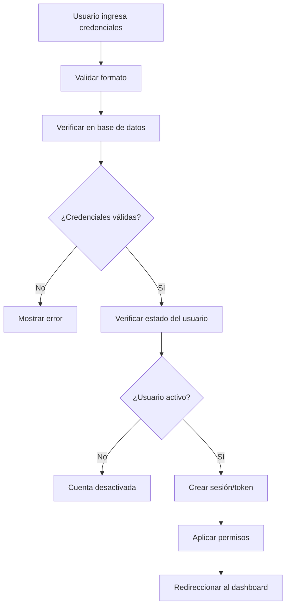

# 🔐 Authentication System - Documentación Completa

## 📋 **Información General**

El sistema de autenticación de MDA está basado en **CodeIgniter Shield**, proporcionando un sistema robusto de autenticación, autorización y gestión de usuarios con características avanzadas de seguridad.

---

## 🏗️ **Arquitectura del Sistema**

### **Componentes Principales**
- **CodeIgniter Shield**: Framework de autenticación base
- **JWT Tokens**: Para APIs y sesiones stateless
- **Session Management**: Gestión avanzada de sesiones
- **Role-Based Access Control (RBAC)**: Control granular de permisos
- **Multi-Factor Authentication**: Autenticación de dos factores (futuro)

### **Flujo de Autenticación**


---

## 👥 **Estructura de Usuarios**

### **Tabla de Usuarios**
```sql
-- Tabla principal de usuarios
CREATE TABLE `users` (
    `id` int(11) unsigned NOT NULL AUTO_INCREMENT,
    `username` varchar(30) DEFAULT NULL,
    `status` varchar(255) DEFAULT NULL,
    `status_message` varchar(255) DEFAULT NULL,
    `active` tinyint(1) NOT NULL DEFAULT 0,
    `last_active` datetime DEFAULT NULL,
    
    -- Información personal
    `first_name` varchar(255) NOT NULL,
    `last_name` varchar(255) DEFAULT NULL,
    `user_type` varchar(50) DEFAULT NULL,
    `role_id` int(11) DEFAULT NULL,
    `phone` varchar(20) DEFAULT NULL,
    
    -- Preferencias de notificación
    `web_notifications` tinyint(1) DEFAULT 1,
    `email_notifications` tinyint(1) DEFAULT 1,
    `sms_notifications` tinyint(1) DEFAULT 0,
    
    -- Configuración adicional
    `client_permissions` text DEFAULT NULL,
    `avatar` varchar(255) DEFAULT NULL,
    `date_format` varchar(20) DEFAULT 'Y-m-d',
    `timezone` varchar(50) DEFAULT 'UTC',
    `client_id` int(11) DEFAULT NULL,
    
    -- Control de estado
    `deleted` tinyint(1) DEFAULT 0,
    `created_at` datetime DEFAULT NULL,
    `updated_at` datetime DEFAULT NULL,
    `deleted_at` datetime DEFAULT NULL,
    
    PRIMARY KEY (`id`),
    KEY `idx_users_active` (`active`),
    KEY `idx_users_user_type` (`user_type`),
    KEY `idx_users_client_id` (`client_id`)
);
```

### **Tipos de Usuario**
```php
$userTypes = [
    'super_admin' => [
        'name' => 'Super Administrator',
        'description' => 'Acceso completo al sistema',
        'permissions' => ['*']
    ],
    'admin' => [
        'name' => 'Administrator',
        'description' => 'Gestión completa de usuarios y configuración',
        'permissions' => ['users:*', 'settings:*', 'reports:*']
    ],
    'manager' => [
        'name' => 'Manager',
        'description' => 'Supervisión de operaciones y staff',
        'permissions' => ['orders:*', 'staff:read', 'reports:read']
    ],
    'staff' => [
        'name' => 'Staff',
        'description' => 'Operaciones diarias del sistema',
        'permissions' => ['orders:read', 'orders:create', 'orders:update']
    ],
    'technician' => [
        'name' => 'Technician',
        'description' => 'Servicios técnicos especializados',
        'permissions' => ['service_orders:*', 'vehicles:read']
    ],
    'client' => [
        'name' => 'Client',
        'description' => 'Acceso limitado a información propia',
        'permissions' => ['orders:read_own', 'profile:update']
    ]
];
```

---

## 🔑 **Sistema de Identidades**

### **Tabla de Identidades (CodeIgniter Shield)**
```sql
-- Identidades de autenticación
CREATE TABLE `auth_identities` (
    `id` int(11) unsigned NOT NULL AUTO_INCREMENT,
    `user_id` int(11) unsigned NOT NULL,
    `type` varchar(255) NOT NULL,        -- email_password, access_token, etc.
    `name` varchar(255) DEFAULT NULL,    -- Nombre descriptivo
    `secret` varchar(255) NOT NULL,      -- Email o token
    `secret2` varchar(255) DEFAULT NULL, -- Password hash o secret adicional
    `expires` datetime DEFAULT NULL,     -- Fecha de expiración
    `extra` text DEFAULT NULL,           -- Datos adicionales (JSON)
    `force_reset` tinyint(1) NOT NULL DEFAULT 0,
    `last_used_at` datetime DEFAULT NULL,
    `created_at` datetime DEFAULT NULL,
    `updated_at` datetime DEFAULT NULL,
    PRIMARY KEY (`id`),
    UNIQUE KEY `type_secret` (`type`,`secret`),
    KEY `user_id` (`user_id`),
    CONSTRAINT `auth_identities_user_id_foreign` 
        FOREIGN KEY (`user_id`) REFERENCES `users` (`id`) ON DELETE CASCADE
);
```

### **Tipos de Identidad Soportados**
```php
$identityTypes = [
    'email_password' => 'Autenticación por email/password',
    'username_password' => 'Autenticación por username/password',
    'access_token' => 'Tokens de acceso para APIs',
    'magic_link' => 'Enlaces mágicos para login',
    'session' => 'Sesiones temporales',
    'api_key' => 'Claves de API para integraciones'
];
```

---

## 👑 **Sistema de Roles y Grupos**

### **Grupos de Usuarios**
```sql
-- Grupos/roles de usuarios
CREATE TABLE `auth_groups_users` (
    `id` int(11) unsigned NOT NULL AUTO_INCREMENT,
    `user_id` int(11) unsigned NOT NULL,
    `group` varchar(255) NOT NULL,
    `created_at` datetime NOT NULL,
    PRIMARY KEY (`id`),
    KEY `auth_groups_users_user_id_foreign` (`user_id`),
    CONSTRAINT `auth_groups_users_user_id_foreign` 
        FOREIGN KEY (`user_id`) REFERENCES `users` (`id`) ON DELETE CASCADE
);
```

### **Definición de Grupos**
```php
// app/Config/AuthGroups.php
public array $groups = [
    'superadmin' => [
        'title' => 'Super Admin',
        'description' => 'Complete control of the site.',
    ],
    'admin' => [
        'title' => 'Admin',
        'description' => 'Day to day administrators of the site.',
    ],
    'manager' => [
        'title' => 'Manager',
        'description' => 'Managers can supervise operations.',
    ],
    'staff' => [
        'title' => 'Staff',
        'description' => 'General staff members.',
    ],
    'technician' => [
        'title' => 'Technician',
        'description' => 'Technical service specialists.',
    ],
    'client' => [
        'title' => 'Client',
        'description' => 'Client users with limited access.',
    ],
];
```

### **Permisos por Grupo**
```php
public array $permissions = [
    // Super Admin - Todo el acceso
    'superadmin' => ['admin.*'],
    
    // Admin - Gestión completa
    'admin' => [
        'users.manage',
        'settings.manage',
        'orders.manage',
        'reports.view',
        'system.backup'
    ],
    
    // Manager - Supervisión
    'manager' => [
        'orders.manage',
        'staff.view',
        'reports.view',
        'clients.manage'
    ],
    
    // Staff - Operaciones diarias
    'staff' => [
        'orders.create',
        'orders.update',
        'orders.view',
        'clients.view',
        'vehicles.view'
    ],
    
    // Technician - Servicios técnicos
    'technician' => [
        'service_orders.manage',
        'vehicles.update',
        'parts.view',
        'tools.manage'
    ],
    
    // Client - Acceso limitado
    'client' => [
        'orders.view.own',
        'profile.update',
        'notifications.view'
    ]
];
```

---

## 🛡️ **Autenticación por API**

### **JWT Tokens**
```php
// Estructura del JWT Token
{
    "iss": "https://yourdomain.com",    // Issuer
    "aud": "mda-api",                   // Audience
    "sub": "user_123",                  // Subject (User ID)
    "iat": 1642678800,                  // Issued At
    "exp": 1642765200,                  // Expiration
    "jti": "token_abc123",              // JWT ID
    "user_data": {
        "id": 123,
        "username": "john.doe",
        "email": "john@example.com",
        "groups": ["staff", "technician"],
        "permissions": ["orders:read", "service_orders:write"],
        "client_id": 5
    }
}
```

### **API Keys**
```php
// Estructura de API Key
CREATE TABLE `api_keys` (
    `id` int(11) unsigned NOT NULL AUTO_INCREMENT,
    `user_id` int(11) unsigned NOT NULL,
    `name` varchar(255) NOT NULL,
    `key_hash` varchar(255) NOT NULL,
    `permissions` json DEFAULT NULL,
    `rate_limit` int(11) DEFAULT 1000,
    `last_used_at` datetime DEFAULT NULL,
    `expires_at` datetime DEFAULT NULL,
    `is_active` tinyint(1) DEFAULT 1,
    `created_at` datetime DEFAULT NULL,
    `updated_at` datetime DEFAULT NULL,
    PRIMARY KEY (`id`),
    UNIQUE KEY `idx_api_keys_hash` (`key_hash`),
    KEY `idx_api_keys_user` (`user_id`)
);
```

### **Autenticación de Requests**
```php
// Middleware de autenticación API
class ApiAuthMiddleware
{
    public function before($request)
    {
        $token = $this->extractToken($request);
        
        if (!$token) {
            return $this->unauthorizedResponse();
        }
        
        if ($this->isJWT($token)) {
            return $this->validateJWT($token);
        }
        
        if ($this->isAPIKey($token)) {
            return $this->validateAPIKey($token);
        }
        
        return $this->unauthorizedResponse();
    }
    
    private function extractToken($request)
    {
        // Bearer Token
        $auth = $request->getHeaderLine('Authorization');
        if (preg_match('/Bearer\s+(.*)$/i', $auth, $matches)) {
            return $matches[1];
        }
        
        // API Key Header
        return $request->getHeaderLine('X-API-Key');
    }
}
```

---

## 🔒 **Seguridad Avanzada**

### **Hashing de Passwords**
```php
// Configuración de password hashing
public array $hashConfig = [
    'algorithm' => PASSWORD_ARGON2ID,
    'options' => [
        'memory_cost' => 65536,  // 64 MB
        'time_cost' => 4,        // 4 iterations
        'threads' => 3,          // 3 threads
    ],
];
```

### **Validación de Passwords**
```php
// Reglas de validación de passwords
public array $passwordRules = [
    'min_length' => 8,
    'max_length' => 255,
    'require_uppercase' => true,
    'require_lowercase' => true,
    'require_numbers' => true,
    'require_symbols' => true,
    'dictionary_check' => true,
    'personal_info_check' => true,
];
```

### **Rate Limiting**
```php
// Límites de intentos de login
public array $rateLimits = [
    'login_attempts' => [
        'max_attempts' => 5,
        'time_window' => 900,    // 15 minutos
        'lockout_time' => 3600,  // 1 hora
    ],
    'password_reset' => [
        'max_attempts' => 3,
        'time_window' => 3600,   // 1 hora
        'lockout_time' => 7200,  // 2 horas
    ],
    'api_requests' => [
        'authenticated' => 1000, // por hora
        'unauthenticated' => 100 // por hora
    ]
];
```

### **Session Security**
```php
// Configuración de sesiones seguras
public array $sessionConfig = [
    'cookie_name' => 'mda_session',
    'cookie_lifetime' => 7200,      // 2 horas
    'cookie_secure' => true,        // Solo HTTPS
    'cookie_httponly' => true,      // No acceso via JS
    'cookie_samesite' => 'Strict',  // Protección CSRF
    'regenerate_id' => true,        // Regenerar ID en login
    'destroy_on_close' => false,    // Mantener sesión
];
```

---

## 🚪 **Filtros de Autenticación**

### **Session Auth Filter**
```php
// app/Filters/SessionAuthFilter.php
class SessionAuthFilter implements FilterInterface
{
    public function before(RequestInterface $request, $arguments = null)
    {
        if (!auth()->loggedIn()) {
            if ($request->isAJAX()) {
                return Services::response()
                    ->setStatusCode(401)
                    ->setJSON(['error' => 'Authentication required']);
            }
            
            return redirect()->to('/login')
                ->with('message', 'Please log in to access this page.');
        }
        
        // Verificar si el usuario está activo
        $user = auth()->user();
        if (!$user->active) {
            auth()->logout();
            return redirect()->to('/login')
                ->with('error', 'Your account has been deactivated.');
        }
        
        // Actualizar última actividad
        $user->last_active = date('Y-m-d H:i:s');
        $user->save();
    }
}
```

### **Permission Filter**
```php
// app/Filters/PermissionFilter.php
class PermissionFilter implements FilterInterface
{
    public function before(RequestInterface $request, $arguments = null)
    {
        if (!auth()->loggedIn()) {
            return redirect()->to('/login');
        }
        
        $requiredPermission = $arguments[0] ?? null;
        
        if ($requiredPermission && !auth()->user()->can($requiredPermission)) {
            if ($request->isAJAX()) {
                return Services::response()
                    ->setStatusCode(403)
                    ->setJSON(['error' => 'Insufficient permissions']);
            }
            
            throw new \CodeIgniter\Exceptions\PageNotFoundException();
        }
    }
}
```

---

## 🔄 **Gestión de Sesiones**

### **Session Management**
```php
// Configuración avanzada de sesiones
class SessionManager
{
    public function extendSession($userId)
    {
        $session = session();
        $session->regenerate();
        $session->set('user_id', $userId);
        $session->set('last_activity', time());
        $session->markAsFlashdata('message');
    }
    
    public function destroySession($userId)
    {
        // Log de logout
        log_message('info', "User {$userId} logged out");
        
        // Limpiar sesión
        $session = session();
        $session->destroy();
        
        // Invalidar tokens JWT (si los hay)
        $this->invalidateUserTokens($userId);
    }
    
    public function checkSessionTimeout()
    {
        $session = session();
        $lastActivity = $session->get('last_activity');
        
        if ($lastActivity && (time() - $lastActivity) > config('Auth')->sessionTimeout) {
            $this->destroySession($session->get('user_id'));
            return false;
        }
        
        $session->set('last_activity', time());
        return true;
    }
}
```

### **Concurrent Sessions**
```php
// Gestión de sesiones concurrentes
CREATE TABLE `user_sessions` (
    `id` varchar(128) NOT NULL,
    `user_id` int(11) unsigned DEFAULT NULL,
    `ip_address` varchar(45) NOT NULL,
    `user_agent` text NOT NULL,
    `created_at` datetime NOT NULL,
    `last_activity` datetime NOT NULL,
    `data` text DEFAULT NULL,
    PRIMARY KEY (`id`),
    KEY `idx_sessions_user_id` (`user_id`),
    KEY `idx_sessions_last_activity` (`last_activity`)
);
```

---

## 🔐 **Two-Factor Authentication (2FA)**

### **Configuración 2FA (Futuro)**
```php
// Tabla para 2FA
CREATE TABLE `user_2fa` (
    `id` int(11) unsigned NOT NULL AUTO_INCREMENT,
    `user_id` int(11) unsigned NOT NULL,
    `method` enum('totp','sms','email') NOT NULL,
    `secret` varchar(255) NOT NULL,
    `backup_codes` json DEFAULT NULL,
    `is_enabled` tinyint(1) DEFAULT 0,
    `verified_at` datetime DEFAULT NULL,
    `created_at` datetime DEFAULT NULL,
    `updated_at` datetime DEFAULT NULL,
    PRIMARY KEY (`id`),
    UNIQUE KEY `idx_user_2fa_user_method` (`user_id`, `method`)
);
```

### **TOTP Implementation**
```php
// Implementación de TOTP (Time-based OTP)
class TOTPService
{
    public function generateSecret($user)
    {
        $secret = $this->generateBase32Secret();
        
        // Guardar secret encriptado
        $this->save2FASecret($user->id, $secret);
        
        return $secret;
    }
    
    public function generateQRCode($user, $secret)
    {
        $issuer = config('App')->siteName;
        $account = $user->email;
        
        $uri = "otpauth://totp/{$issuer}:{$account}?secret={$secret}&issuer={$issuer}";
        
        return $this->generateQRCodeImage($uri);
    }
    
    public function verifyToken($user, $token)
    {
        $secret = $this->get2FASecret($user->id);
        return $this->validateTOTP($secret, $token);
    }
}
```

---

## 📊 **Auditoría y Logging**

### **Authentication Logs**
```sql
-- Tabla de logs de autenticación
CREATE TABLE `auth_logs` (
    `id` int(11) unsigned NOT NULL AUTO_INCREMENT,
    `user_id` int(11) unsigned DEFAULT NULL,
    `email` varchar(255) DEFAULT NULL,
    `event_type` enum('login','logout','failed_login','password_reset','account_locked') NOT NULL,
    `ip_address` varchar(45) NOT NULL,
    `user_agent` text NOT NULL,
    `success` tinyint(1) NOT NULL,
    `failure_reason` varchar(255) DEFAULT NULL,
    `session_id` varchar(128) DEFAULT NULL,
    `created_at` datetime NOT NULL,
    PRIMARY KEY (`id`),
    KEY `idx_auth_logs_user_id` (`user_id`),
    KEY `idx_auth_logs_event_type` (`event_type`),
    KEY `idx_auth_logs_ip_address` (`ip_address`),
    KEY `idx_auth_logs_created_at` (`created_at`)
);
```

### **Security Events**
```php
// Eventos de seguridad monitoreados
$securityEvents = [
    'multiple_failed_logins' => 'Múltiples intentos de login fallidos',
    'login_from_new_location' => 'Login desde nueva ubicación',
    'password_changed' => 'Contraseña cambiada',
    'email_changed' => 'Email cambiado',
    'permissions_changed' => 'Permisos modificados',
    'account_locked' => 'Cuenta bloqueada',
    'suspicious_activity' => 'Actividad sospechosa detectada'
];
```

---

## 🚀 **Performance y Optimización**

### **Database Optimization**
```sql
-- Índices optimizados para autenticación
CREATE INDEX idx_auth_identities_lookup ON auth_identities (type, secret);
CREATE INDEX idx_users_active_lookup ON users (active, user_type);
CREATE INDEX idx_sessions_cleanup ON user_sessions (last_activity);
CREATE INDEX idx_auth_logs_security ON auth_logs (ip_address, event_type, created_at);
```

### **Caching Strategy**
```php
// Cache de permisos y roles
$cacheConfig = [
    'user_permissions' => 3600,     // 1 hora
    'user_groups' => 7200,          // 2 horas
    'session_data' => 1800,         // 30 minutos
    'failed_attempts' => 900,       // 15 minutos
];
```

---

## 🔮 **Roadmap de Autenticación**

### **Próximas Funcionalidades**
- [ ] **Two-Factor Authentication (2FA)**: TOTP, SMS, Email
- [ ] **Social Login**: Google, Microsoft, GitHub
- [ ] **Single Sign-On (SSO)**: SAML, OAuth2
- [ ] **Biometric Authentication**: Fingerprint, Face ID
- [ ] **Risk-based Authentication**: ML para detección de riesgo

### **Mejoras de Seguridad**
- [ ] **Advanced Rate Limiting**: Límites adaptativos
- [ ] **Behavioral Analysis**: Análisis de comportamiento
- [ ] **Device Fingerprinting**: Identificación de dispositivos
- [ ] **Geolocation Verification**: Verificación por ubicación
- [ ] **Password-less Authentication**: WebAuthn, Magic Links

---

**El sistema de autenticación de MDA proporciona una base sólida y segura para la gestión de usuarios, con características avanzadas de seguridad y escalabilidad.**

---

*Documentación actualizada: 2025-01-19*  
*Versión del sistema de auth: MDA v2.0*  
*Para más información: [Volver a Documentación Principal](../../claude.md)*


